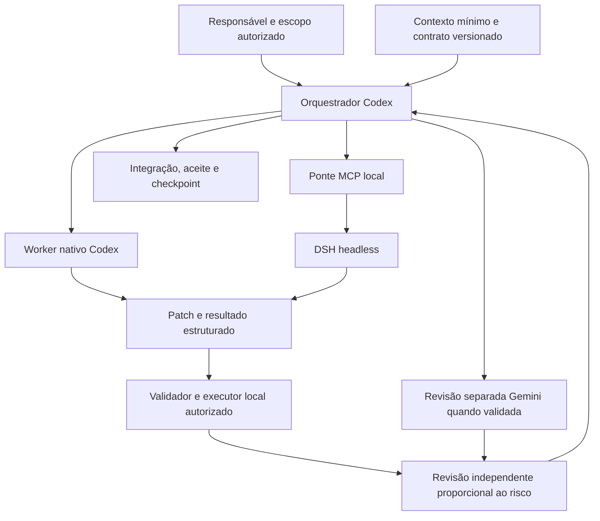

# Guia Definitivo: Desenvolvimento de Agentes Autônomos (Metodologia Comércio 360)

**Versão 1.0 — 01/10/2026.** Manual de referência para replicar a metodologia em outros repositórios. Consolidação documental das implementações e evidências disponíveis até 30/09/2026; não representa uma nova execução do harness.

**Princípio central:** cada agente recebe uma tarefa autorizada, uma base identificada, contexto suficiente e critérios verificáveis. A entrega só é aceita depois de conferir arquivos, evidências e integração. Autonomia é exercida dentro desse escopo.

O guia distingue três situações:

- **Validado no Comércio 360:** existe implementação ou evidência de execução indicada na seção.
- **Regra operacional:** procedimento adotado, cuja aplicação pode depender do orquestrador; não presumir enforcement automático.
- **Adaptação em outro projeto:** template ou decisão a preencher e validar. Placeholders não são configurações prontas nem resultados reais.

Algumas fontes preservam retratos anteriores. Para estado atual, prevalecem os registros posteriores de [telemetria G](docs/ai/TELEMETRIA_G.md), [H-04](docs/ai/RELATORIO_H04.md) e os contratos vigentes. Este manual não transforma propostas antigas em autorização de execução.

## 1. Introdução à Metodologia Comércio 360

### 1.1. O stack e a responsabilidade de cada ferramenta

| Componente | Papel na metodologia | Evidência e limite observado |
| --- | --- | --- |
| Codex | Orquestrador: interpreta escopo, cria contratos, escolhe workers, integra e registra o aceite | H-03 integrado e H-04 sintético executado; medição de tokens por tarefa ainda sem equivalência à rota DSH |
| DeepSeek Harness — DSH | Runtime externo que executa uma tarefa delimitada e devolve resposta final | Perfil `headless` 0.1.5-rc.3 usado em H-03/H-04; autenticação e execução precisam ser verificadas separadamente da saúde |
| MCP | Protocolo entre o cliente Codex e a ponte que expõe ferramentas DSH | `dsh_health` e `dsh_delegate` disponíveis; não constitui sandbox nem validação semântica da entrega |
| Ponte MCP local | Adapta o DSH ao cliente, valida entrada, controla processo e retorna resultado/telemetria | Integração comunitária adaptada para Windows; versão instrumentada `0.1.0-c360.2` |
| VS Code | Superfície de trabalho: editor, terminal, tarefas e extensões | Rota VS Code → extensão Codex → MCP DSH registrada; extensões têm configurações e credenciais próprias |
| Antigravity/Gemini | Rota separada para especialista ou revisão | Apenas teste mínimo `READY` com `Gemini 3.1 Pro Low` selecionado; não há benchmark de engenharia ou custo dessa rota |
| Skills | Procedimentos reutilizáveis de domínio, dados, aplicação, interface, orquestração e verificação | Seis skills com estrutura conferida; estrutura válida não prova comportamento correto em toda tarefa |
| Git, validador e executor de testes | Identificam base, detectam alterações e produzem evidência determinística | Validador 0.1 com limites explícitos; execução dinâmica centralizada após problemas no sandbox DSH |

**Agente, skill e ferramenta são conceitos diferentes.** O agente executa uma tarefa; a skill orienta um procedimento; a ferramenta realiza uma operação; o runtime aplica as permissões disponíveis. Um arquivo Markdown não restringe sozinho o sistema de arquivos.



A rota Gemini não foi demonstrada como subagente acionado pelo MCP DSH. Seu intercâmbio deve usar um pacote explícito de tarefa ou revisão. Não presumir compartilhamento de memória, autenticação ou permissões entre as ferramentas.

### 1.2. O que a experiência demonstrou

| Marco | Resultado consolidado | O que ele não comprova |
| --- | --- | --- |
| H-01/H-02 | Base Git, seis perfis, seis skills e validador implementados | Todos os perfis iniciados automaticamente ou todo contrato imposto pelo runtime |
| H-03 | DSH encontrou três falhas no validador; reproduzidas, corrigidas e integradas em `4a80096` | Economia de tokens ou superioridade geral do modelo |
| H-04 D1 | Correção de seleção de contexto; testes direcionados 7/7 e revisões dos dois braços | Comparação confiável de tempo: houve interrupção por créditos e telemetria insuficiente |
| H-04 S1 | Correção SQL validada após revisões; DSH exigiu correções de dependência de ordem nos testes | Que testes passando em conjunto sejam independentes ou detectem a regressão pretendida |
| H-04 U1 | Gate externo U1-V5 completo 6/6 nos dois braços; foco DSH 2/2; revisão registrada | Reparo do runner original: U1-V1 continua FAIL no histórico Codex e `not_run` no DSH |
| G | Uma chamada DSH real teve tokens do provedor, duração e JSONL correspondentes; suíte harness histórica 16/16 | Custo total do fluxo, cobertura de subagentes ou comparação financeira com Codex |

H-04 foi encerrada como experimento sintético. Seus patches ficaram nos clones descartáveis. O resultado final U1-DSH foi composto pelo orquestrador a partir do patch parcial, correções e verificações; não foi uma conclusão autônoma integral do worker. A substituição de gate vale somente para esse experimento.

Fontes: [plano](docs/ai/PLANO_ORQUESTRACAO.md), [relatório H-03](docs/ai/RELATORIO_H03.md), [relatório H-04](docs/ai/RELATORIO_H04.md) e [índice de resultados](docs/ai/H04_RESULTADOS_INDICE.md).

### 1.3. Roteamento e escala

O plano adotou Sol com raciocínio alto para orquestração habitual e Astra para arquitetura transversal ou revisão de alto risco. Isso é uma política do projeto, não uma classificação universal de preço ou qualidade. Em um novo ambiente, confirmar nomes e opções realmente disponíveis antes de configurar um perfil.

1. Resolver diretamente tarefas simples e delimitadas quando a delegação acrescentar mais coordenação que benefício.
2. Delegar uma unidade independente, com dono explícito dos arquivos e resultado verificável.
3. Começar com um worker; ampliar paralelismo quando as dependências e a integração estiverem controladas.
4. Reservar contexto independente para revisão. Mesmo modelo pode revisar; diferença de modelo não garante independência.
5. Não permitir delegação recursiva ou mudança de modelo/contrato pelo worker sem encaminhar a decisão ao orquestrador.
6. Depois de duas correções sem avanço verificável, interromper a repetição e diagnosticar ambiente, contrato ou escopo.

Não duplicar a mesma implementação em dois modelos como rotina. Comparações pertencem a avaliações isoladas, com a mesma base e protocolo. Um escritor por arquivo; integração serial dos pontos compartilhados.

## 2. Pré-requisitos e setup do ambiente

### 2.1. Preparar o repositório antes dos agentes

São necessários Git, Node.js/npm compatíveis com os pacotes escolhidos, acesso autorizado ao provedor e um workspace delimitado. Conferir versões reais; este guia não define uma versão mínima de Node que não tenha sido testada pelo projeto.

**Inventário inicial**, no diretório do novo repositório:

```powershell
git status --short
git rev-parse HEAD
node --version
npm --version
code --list-extensions --show-versions
```

Se ainda não existe commit, criar primeiro um baseline revisado, com exclusões de segredos, dependências e artefatos temporários. O validador atual não aceita uma base Git inexistente. Inspecionar o conteúdo antes de versionar; não copiar o ambiente pessoal do Comércio 360.

Estrutura de referência, adaptável ao novo projeto:

```text
AGENTS.md                         regras locais obrigatórias
context.md                        estado, limites e próximo passo
GEMINI.md                         entrada da rota Gemini, se utilizada
.agents/skills/<skill>/SKILL.md    procedimentos por especialidade
.codex/agents/<perfil>.toml        perfis de workers
.vscode/                          recomendações e tarefas do editor
docs/ai/
  PLANO_ORQUESTRACAO.md
  CONTRATOS_HARNESS.md
  REPOMAP.md
  TELEMETRIA_G.md
  evidencias/<execucao>/
scripts/harness/                   validador, mapa e adaptadores
tests/                            testes dos controles implementados
```

Copiar a estrutura e os procedimentos pertinentes; substituir nomes, invariantes, autorização e caminhos do Comércio 360. Domínio de varejo, RLS, Supabase e Next.js só entram quando pertencem ao novo projeto.

### 2.2. VS Code: instalação e configuração observadas

O registro de integração apresenta estas extensões/versões históricas; não são uma lista de versões atuais recomendadas:

| Identificador registrado | Versão registrada | Papel e resultado |
| --- | --- | --- |
| `openai.chatgpt` | 26.5917.62051 | Cliente Codex no editor |
| `google.geminicodeassist` | 2.100.0 | A rota Individual falhou com “client no longer supported” |
| Companion Gemini CLI | 0.20.0 | Presença registrada; não prova acesso ao modelo |
| `google.antigravity` | 1.5.0 | Resposta mínima depois de reabrir a janela |
| `lixxx1.dsh-sidebar` | 0.0.5 | Extensão comunitária aprovada pelo responsável; cofre próprio no VS Code |

Procedimento de reprodução:

1. Abrir o novo repositório no VS Code e conferir o workspace ativo.
2. Instalar pela distribuição legítima da ferramenta escolhida, verificando publicador, versão, origem e acesso solicitado. O histórico não é prova de disponibilidade atual no Marketplace.
3. Habilitar Codex e confirmar acesso à conta. Instalar Sidebar/Gemini somente quando essa rota for necessária.
4. Configurar tarefas locais do projeto; confirmar que os comandos existem em `package.json`.
5. Inventariar extensões com o comando acima e executar uma verificação mínima da rota escolhida.

Configuração efetivamente usada para abrir a lateral Codex:

```json
{
  "chatgpt.openOnStartup": true
}
```

Tarefas efetivamente presentes em [.vscode/tasks.json](.vscode/tasks.json):

```json
{
  "version": "2.0.0",
  "tasks": [
    {
      "label": "C360: validar harness",
      "type": "shell",
      "command": "npm run test:harness",
      "group": "test",
      "problemMatcher": []
    },
    {
      "label": "C360: lint",
      "type": "shell",
      "command": "npm run lint",
      "group": "test",
      "problemMatcher": []
    }
  ]
}
```

Em outro projeto, renomear os rótulos e adaptar comandos. O arquivo de recomendações atual lista somente Codex e Gemini Code Assist; não confundir recomendação de extensão com inventário de extensões instaladas.

### 2.3. DSH: instalação, perfil e ponte são etapas separadas

O pacote comprovado no histórico foi `@deepseek-ai/dsh`, versão `0.1.5-rc.3`, instalado globalmente no Windows. A ponte MCP veio do repositório comunitário [dsh-cursor-codex](https://github.com/jeremy9682/dsh-cursor-codex), revisão `81def5abbc01bd5b461710ed11a595bb4355f5f7`, com adaptações locais e licença MIT.

**Sequência reproduzível a partir dessa base:**

1. Obter o DSH pela distribuição documentada do pacote e fixar a versão escolhida. Registrar a instalação; não presumir compatibilidade do overlay de telemetria com outra versão.
2. Localizar o executável Node e o entrypoint do CLI no `package.json` da instalação. A ponte exige caminho absoluto do CLI; não inventar o nome do arquivo de entrada.
3. Conferir versão e inicializar o perfil `headless` pelo comando observado `--profile headless --help`.
4. Confirmar o manifesto em `profiles/headless/package.json` e o patch do perfil. No histórico, foram usados `@deepseek-ai/dsh-base` e `@deepseek-ai/dsh-headless`.
5. Preparar a ponte local, suas dependências locais, licença, hash e backup. Para usar G, incluir o conjunto completo da seção 5.2.
6. Configurar o cliente MCP e verificar protocolo antes de enviar tarefa ao modelo.

Template de verificação — preencher caminhos existentes antes de executar:

```powershell
$nodeExe = '<CAMINHO_ABSOLUTO_NODE_EXE>'
$dshCli = '<ENTRYPOINT_ABSOLUTO_CONFIRMADO_NO_PACKAGE_JSON>'
& $nodeExe $dshCli --version
& $nodeExe $dshCli --profile headless --help
```

Esses comandos verificam instalação/perfil; não delegam trabalho. A delegação operacional usa `dsh_delegate` nativo. O pacote sugerido inicialmente `@jeremy9682/dsh-mcp-server` retornou E404 e **não** é o caminho reproduzido. Também não confundir `dsh-plugin-codex-bridge`, que levava contexto Codex ao DSH, com servidor MCP de delegação.

Configurações distintas no histórico:

| Local | Função |
| --- | --- |
| `~/.codex/config.toml` | Cadastro MCP ativo do cliente |
| `~/.codex/dsh.config.toml` | Referência local; não era importado automaticamente |
| `~/.dsh/settings.yaml` | Seleção de provedor/modelo/esforço |
| `~/.dsh/profiles/<perfil>/` | Manifesto e configuração do perfil usado pelo launcher |
| `~/.dsh/config.yml` | Arquivo encontrado, mas não era a configuração efetiva daquele launcher |

Fonte: [diagnóstico MCP](docs/ai/DIAGNOSTICO_DSH_MCP.md). A inspeção de configuração não autoriza abrir arquivos de credenciais.

### 2.4. Antigravity/Gemini: estabelecer uma rota independente

O que funcionou foi uma resposta mínima sem ferramentas depois de fechar e reabrir a janela, com `Gemini 3.1 Pro Low` selecionado. Tentativas anteriores de reiniciar somente o agente não resolveram. A falha da rota Gemini Code Assist Individual permaneceu registrada; instalar uma extensão não demonstrou que todas as rotas Google estivessem disponíveis.

Para reproduzir o procedimento em outro ambiente:

1. Confirmar produto, publicador, conta, modelo selecionado e acesso efetivo na instalação local.
2. Fornecer um `GEMINI.md` curto que aponte para regras e contexto do projeto. O [GEMINI.md existente](GEMINI.md) é referência de conteúdo, não prova de discovery em todos os produtos Google.
3. Fazer uma única chamada mínima sem ferramentas para distinguir acesso ao modelo de problemas da tarefa.
4. Depois, usar uma tarefa pequena de leitura com base, critérios e saída definidos; só essa entrega permite avaliar engenharia.
5. Devolver resultado ao orquestrador com arquivos, achados e verificações. A resposta Gemini não concede aceite da integração.

Não há evidência neste workspace de uma cadeia automática Codex → Antigravity → DSH. Replicar essa integração exigiria implementação e avaliação próprias.

### 2.5. Chaves, nuvem/GCP e orçamento

**Credenciais verificadas como rotas de armazenamento, sem leitura de seus valores:**

| Rota | Armazenamento/entrada registrado | Consequência |
| --- | --- | --- |
| DSH Sidebar | VS Code SecretStorage | Configurar a Sidebar não prova autenticação do headless |
| DSH Web | Settings → Models, chave write-only no cofre DSH | Uma resposta Web não prova acesso pelo MCP |
| DSH headless | Cofre DSH ou ambiente; precedência documentada ambiente → cofre → `.env` | Variável antiga pode sobrepor configuração do cofre; diagnosticar sem imprimir segredos |
| Codex/Gemini | Conta e autenticação da rota utilizada | Não assumir que compartilham a chave do DSH |

O responsável configura a credencial na superfície apropriada. Prompts, Git, screenshots, relatórios e JSONs recebem somente metadados sanitizados. Não solicitar chaves por chat nem delegar leitura de cofres. Registrar autorização para envio do contexto ao provedor, respeitando o escopo já concedido; não repetir pedidos a cada worker.

**GCP: limite da evidência.** Não foi encontrada nas fontes exigidas uma implantação validada de Vertex AI, projeto GCP, conta de faturamento, IAM ou budget. Portanto, não há comandos de provisionamento GCP apresentados como receita comprovada do Comércio 360. A presença de Gemini/Antigravity não demonstra que a execução use uma conta de faturamento GCP da equipe.

Se outro projeto adotar GCP, abrir um registro específico com serviço/rota, projeto e conta de cobrança quando aplicáveis, autenticação exigida, responsável, escopo e evidência da primeira chamada. Não criar chave de conta de serviço por inferência a partir do nome Gemini.

Como referência externa complementar, budgets de alerta do Cloud Billing permitem definir período, escopo, valor e destinatários; **um budget somente de alertas não impõe teto automático de gasto**. Configurar e testar o controle aplicável ao serviço escolhido antes de tratá-lo como bloqueio. Essa orientação não é uma implantação GCP realizada pelo Comércio 360. [Documentação Google Cloud Billing, consultada em 01/10/2026](https://docs.cloud.google.com/billing/docs/how-to/budgets).

O controle de orçamento da metodologia combina escopo pequeno, limite de tentativas, ausência de chamadas duplicadas, telemetria e decisão explícita de continuar. Não foram comprovados um limitador monetário automático, um teto de tokens imposto pela ponte ou economia percentual. `timeout_ms` limita duração da chamada; não é orçamento financeiro.

## 3. Arquitetura e fluxo de integração — passo a passo

### Etapa 1 — Modelagem do agente: papel, escopo e propriedade

**Entrada:** requisito autorizado e contratos existentes. **Saída:** uma unidade de trabalho atribuída a um worker, sem decisões comerciais implícitas.

| Especialidade inicial | Responsabilidade | Fronteira a preservar |
| --- | --- | --- |
| Infra e Dados | Migrações novas, RLS, RPCs, integridade e testes SQL | Não alterar migração aplicada nem executar banco remoto por conta própria |
| Domínio e Validação | Regras puras, esquemas e fronteiras de entrada | Não inventar regra ausente ou acoplar regra a rede/UI |
| Aplicação | Ações, consultas e adaptadores de servidor | Consumir contratos aceitos e revalidar autorização |
| Frontend | Estados de tela, teclado, foco, acessibilidade e apresentação | Permissão visual não substitui autorização no servidor |
| QA | Cenários, evidências e reprodução de falhas | Não enfraquecer teste para obter PASS |
| Segurança/Arquitetura | Revisão de isolamento, concorrência, auditoria e limites | Contexto independente; leitura por padrão |

Os seis perfis existentes usam seis skills porque QA e Segurança compartilham `c360-verificar` em modos diferentes, enquanto o orquestrador usa `c360-orquestrar`. Não existe correspondência obrigatória um perfil = uma skill.

Exemplo real de perfil, em [.codex/agents/c360-dominio-validacao.toml](.codex/agents/c360-dominio-validacao.toml):

```toml
name = "c360-dominio-validacao"
description = "Regras puras, esquemas de entrada e testes de fronteira de módulo aceito do Comércio 360."
developer_instructions = """
Leia AGENTS.md e context.md antes de trabalhar. Use .agents/skills/c360-dominio/SKILL.md quando a tarefa envolver domínio ou validação. Exija envelope com base, autorização, contrato, arquivos permitidos e critérios. Não invente regra comercial nem acople domínio a Supabase, rede ou UI. Reporte resultado e evidências em docs/ai/CONTRATOS_HARNESS.md; devolva needs_context para decisão essencial ausente.
"""
```

Ao adaptar, substituir referências do projeto e atribuir arquivos exatos. Uma skill deve conter gatilho específico, fontes condicionais, procedimento, limites e saída. A [skill de domínio](.agents/skills/c360-dominio/SKILL.md) demonstra frontmatter `name`/`description` e um corpo curto, com regras sobre unidades, ausência versus zero e decisões faltantes.

**Verificação de conclusão desta etapa:** o perfil é descoberto pelo runtime, a skill é carregada quando pertinente, o worker conhece sua allowlist e sabe devolver `needs_context`. Validar sintaxe e também um cenário positivo/negativo; `check-skills.mjs` não comprova todo esse comportamento.

### Etapa 2 — Criar contratos Markdown e envelopes executáveis

Há duas camadas:

1. **Contrato `.md`:** explica responsabilidades, invariantes, critérios, evidência, revisão e retomada.
2. **Envelope `.json`:** instancia uma tarefa e uma revisão contra uma base específica; o validador confere parte desse acordo.

Template de documento, derivado dos [CONTRATOS_HARNESS.md](docs/ai/CONTRATOS_HARNESS.md), para preencher antes da execução:

```markdown
# Contrato do pacote <nome> — revisão <n>

## Objetivo e autorização
Resultado observável, fonte do aceite e limites autorizados.

## Base e dependências
Workspace, commit completo, mudanças locais e entregas prévias aceitas.

## Responsáveis e arquivos
Worker, revisor, read_refs, write_allowlist e protected_paths.

## Interfaces e invariantes
Entrada, saída, erros, autorização, atomicidade, idempotência,
concorrência e auditoria; justificar campos não aplicáveis.

## Critérios de aceite
IDs estáveis e condições verificáveis.

## Verificações
IDs, procedimento/comando, ambiente, executor e evidência exigida.

## Resultado, revisão e integração
Esquema, integridade, achados e responsável pelo aceite.

## Parada e retomada
Contexto ausente, duas correções sem avanço, checkpoint e próxima ação.
```

Campos do envelope 0.1 que precisam estar presentes:

| Grupo | Campos |
| --- | --- |
| Identidade | `schema_version`, `task_id`, `contract_revision` |
| Finalidade | `objective`, `mode`, `authorization` |
| Base | `workspace`, `baseline` |
| Execução solicitada | `role`, `runtime`, `model`, `reasoning`, `depends_on` |
| Contexto e propriedade | `read_refs`, `write_allowlist`, `protected_paths` |
| Aceite | `invariants`, `acceptance`, `checks` |
| Restrições | `constraints`, `stop_conditions` |

Usar como referência preenchida o [envelope real U1 revisão 2](docs/ai/evidencias/h04-u1-2026-09-30/task-dsh-r2.json); adaptar todos os campos. Não despachá-lo em outro repositório nem copiar sua autorização.

**Limites do validador atual:**

- Aceita `baseline.kind = "git"`, com SHA completo igual ao HEAD. O modo `task` exige árvore limpa. `manifest` consta da especificação, mas não está implementado como alternativa utilizável.
- Permite caminho exato ou prefixo de diretório terminado em `/`; rejeita travessia e caminhos protegidos. Compara mudanças reais do Git com atribuição e resultado.
- Zod rejeita campos desconhecidos. Não acrescentar `run_id`, budget ou blocos arbitrários ao JSON 0.1; associar metadados em evidência/registro externo ou evoluir o esquema explicitamente.
- Confere todos os critérios, referências e hashes declarados. Completude/semântica dos checks, segredo no conteúdo e significado do aceite ainda exigem inspeção do orquestrador.
- O Git não captura arquivos ignorados nessa validação. Conferência posterior não impede escrita indevida durante a execução.

**Validação antes/depois**, com caminhos preenchidos para os arquivos da tarefa:

```powershell
node scripts/harness/validate.mjs task <caminho-da-tarefa.json>
node scripts/harness/validate.mjs result <caminho-da-tarefa.json> <caminho-do-resultado.json>
```

Essas linhas são templates de argumentos, não comandos prontos para copiar com os sinais `< >`. Para uma tarefa somente leitura, manter envelope/resultado fora do workspace examinado quando sua criação tornaria a árvore suja. Evidências referenciadas devem respeitar o resolvedor seguro do contrato.

O exemplo conceitual com `manifest`/base nula no documento original não é um envelope despachável pelo validador atual. Começar por uma base concreta, não por esse exemplo incompleto.

**Resultado enxuto:** eliminar prosa repetida e referenciar logs; conservar critérios, IDs, procedimentos e metadados exigidos. Não juntar checks diferentes nem rebatizar uma inspeção como teste executado. O resultado persistido é autocontido: a versão 0.1 não resolve herança entre deltas.

### Etapa 3 — Configurar MCP, arquivos e ferramentas externas

O cadastro do provedor de modelo e o cadastro de servidor MCP são distintos. O problema original foi resolvido quando `[mcp_servers.dsh]` passou a existir no config ativo. Arquivos com nome semelhante a `config.toml` não são includes automáticos.

O Codex usa `config.toml` para MCP; clientes locais do mesmo host compartilham essa configuração. Reiniciar o cliente/servidor que mantém a conexão é necessário para verificar a configuração carregada. [Documentação oficial MCP](https://learn.chatgpt.com/docs/extend/mcp).

Template sanitizado baseado nos campos efetivamente usados pela ponte. Substituir **todos** os placeholders e criar os diretórios necessários; não colocar chaves aqui:

```toml
[mcp_servers.dsh]
command = "<NODE_ABSOLUTO>"
args = ["<PONTE_ABSOLUTA>/dsh-mcp.mjs"]
cwd = "<REPOSITORIO_ABSOLUTO>"
enabled = true
startup_timeout_sec = 30
tool_timeout_sec = 660
enabled_tools = ["dsh_health", "dsh_delegate"]

[mcp_servers.dsh.env]
DSH_CLI_PATH = "<CLI_ABSOLUTO_CONFIRMADO>"
DSH_HOME = "<HOME_DSH_ABSOLUTO>"
DSH_MCP_PROFILE = "headless"
DSH_MCP_ALLOWED_WORKSPACES = '["<REPOSITORIO_ABSOLUTO>"]'
DSH_MCP_TELEMETRY_PATCH = "<REPOSITORIO_ABSOLUTO>/scripts/harness/dsh-telemetry.patch.yml"
DSH_MCP_TELEMETRY_MODULE = "file:///<CAMINHO_URL_DO_REPOSITORIO>/scripts/harness/dsh-telemetry-headless.mjs"
DSH_MCP_TELEMETRY_LOG = "<DIRETORIO_LOCAL_EXISTENTE>/telemetry.jsonl"
```

No Windows, usar caminhos absolutos com `/` ou escape TOML correto; URLs `file:///C:/...` precisam de codificação válida quando o caminho contiver espaços. O array JSON dentro da string TOML deve conter somente workspaces existentes e autorizados. **O patch YAML também contém uma URL absoluta do overlay** e precisa ser adaptado; mudar apenas uma variável não corrige o arquivo.

**Verificações em ordem:**

1. Conferir sintaxe, caminhos, versões, hashes e proveniência; preservar backup da configuração anterior.
2. Inspecionar cadastro com **`codex mcp get dsh --json`**, mantendo o resultado local e sem divulgar eventuais valores sensíveis.
3. Reiniciar o servidor MCP na superfície que mantém a conexão. Recarregar apenas VS Code não comprova recarga do servidor usado pelo Desktop.
4. Conferir inicialização, `tools/list`, schemas, rejeição de argumentos extras, cwd externo/relativo e timeout inválido. O diagnóstico registra um `verify-mcp.mjs` local para esses testes; ele não é um arquivo portátil garantido em todo repositório.
5. Chamar **`dsh_health({})`** pelo MCP nativo e conferir versão, perfil, workspaces e capacidade de telemetria.
6. Executar uma única tarefa mínima autorizada. `health.ok`, presença de perfil e `telemetry.enabled` não comprovam autenticação nem contadores reais.

Acesso a arquivos ocorre pelo runtime e suas ferramentas. A ponte DSH não oferece um servidor genérico de arquivos nem herda automaticamente todas as restrições do cliente Codex. A allowlist confere a raiz de lançamento; revisar também perfil, ferramentas, ambiente e segredos acessíveis ao processo.

Para ferramenta externa adicional, registrar servidor real, contrato de entrada/saída, autenticação, ações de leitura/escrita e escopo necessário. Não conectar toda conta ou repositório só porque existe um plugin. Primeiro validar uma operação de leitura; liberar escrita somente conforme a tarefa e as permissões aplicáveis.

### Etapa 4 — Executar, revisar e integrar

#### A. Preparar a unidade de trabalho

1. Ler as regras locais e o contexto atual uma vez no início da tarefa.
2. Identificar base, candidato e alterações locais; não limpar com reset para satisfazer o validador.
3. Separar ambiente de execução quando necessário. Clones H-04 foram sanitizados e auditados byte a byte; o primeiro preparo Windows alterou finais de linha e foi descartado.
4. Emitir contrato com um dono por arquivo, sem mudanças concorrentes em lockfile, navegação, migrações ou documentos de integração.
5. Validar elegibilidade, dependências e envelope antes do despacho.

#### B. Enviar pela ferramenta certa

O contrato real de transporte é este; trata-se de um **template**, não de uma execução:

```json
{
  "task": "<Objetivo; revisão/base; fontes mínimas; arquivos permitidos; invariantes; critérios; checks e executores; saída 0.1; condições de parada>",
  "cwd": "<WORKSPACE_ABSOLUTO_AUTORIZADO>",
  "timeout_ms": 600000
}
```

- `task` e `cwd` são obrigatórios; `timeout_ms` deve estar entre 1.000 e 600.000 ms.
- Briefing limitado a 20.000 caracteres pela ponte; isso não mede todos os tokens lidos pelo worker.
- A ponte permite uma execução por vez. Não criar chamadas concorrentes para contornar essa restrição.
- `context`, `sandbox` e `max_iterations` não são parâmetros aceitos. A ponte não impõe 25 iterações.
- Enviar a cápsula de tarefa e referências úteis dentro de `task`; não serializar o repositório inteiro.
- Usar MCP nativo. Rodar headless por shell/HTTP como substituto da delegação muda o caminho de controles e evidência.

Nas delegações nativas Codex, usar contexto sem histórico integral quando o runtime permitir, com briefing autocontido. A opção registrada no ambiente foi `fork_turns="none"`; não é um parâmetro DSH.

#### C. Executar verificações e revisão proporcional

| Responsável | Trabalho padrão |
| --- | --- |
| Worker DSH | Código e verificações estáticas aplicáveis: tipos, whitespace e sintaxe |
| Executor do orquestrador | Vitest/Playwright em ambiente autorizado, com candidato e logs identificados |
| Revisor independente | Critérios, código pertinente, diff, logs e integridade; teste direcionado se houver risco ou dúvida concreta |
| Orquestrador | Resolver achados, integrar, validar o conjunto e registrar aceite |

**Uma execução canônica por candidato e ambiente.** Repetir a fatia afetada quando o código mudar, a captura estiver incompleta, houver instabilidade ou um achado exigir reprodução. Registrar por que repetiu. “Testes externos” significa fora do sandbox do worker, em executor autorizado; não significa desativar todas as permissões.

No caso S1, os testes dependiam de alterações efetuadas por testes anteriores na mesma instância PGlite. A correção final isolou o estado; execuções individuais e com ordem embaralhada foram justificadas por um defeito concreto. Esse é um exemplo de revisão útil mesmo depois de uma suíte passar.

#### D. Persistir e encerrar

1. Validar JSON e alterações reais; `ready_for_review` é declaração de prontidão, não aceite.
2. Revisar com contexto independente, sem apresentar a conclusão do autor como resposta esperada.
3. Integrar apenas o escopo aceito e executar os gates exigidos para a integração.
4. Salvar comandos, status, hashes, achados, pendências e decisão. Evidência antiga permanece imutável.
5. Atualizar `context.md` como índice e produzir checkpoint quando houver interrupção.

O checkpoint registra objetivo, contrato, base, arquivos parciais/hashes, verificações concluídas, processos cuja atribuição ainda precisa ser confirmada e próxima ação. Cancelar a espera de uma ferramenta não prova que seu processo filho terminou. No Windows, encerrar somente auxiliares identificados como pertencentes à execução; não reutilizar PID antigo sem conferência.

## 4. Gestão de contexto e eficiência de tokens

### 4.1. RepoMap e fragmentação condicional trabalham juntos

RepoMap evita exploração ampla e recortes arbitrários; **orienta a fragmentação condicional**. Ele não elimina a necessidade de selecionar contexto. A tríade implementada foi: mapa estrutural + carregamento condicional + testes externos.

O [repomap.mjs](scripts/harness/repomap.mjs) usa heurísticas de linhas, sem dependência nova. Não é Tree-sitter, grafo semântico ou índice completo de chamadas. O mapa omite tipos, limita símbolos e pode apresentar assinaturas incompletas. Abra a fonte antes de modificar ou concluir algo sobre o contrato.

**Uso prático:**

```powershell
npm run repomap
rg -n 'selectContext|tenancy' docs/ai/REPOMAP.md
rg -n 'selectContext' packages lib tests
```

O exemplo localiza a área e depois os usos relevantes. Ler a função completa, os tipos/imports necessários, o chamador que define a autorização e o teste correspondente. Não enviar só uma linha sem o contrato que lhe dá sentido.

Regenerar após mudança estrutural ou scripts novos. O mapa atual medido nesta consolidação tem **11.734 bytes**; a estimativa inicial de 1–2 mil tokens não é um limite garantido. O cálculo do script é aproximado e `content.length` não mede bytes UTF-8 com exatidão. Não o usar para cobrança.

### 4.2. Quatro níveis de leitura

| Nível | Conteúdo | Quando carregar |
| --- | --- | --- |
| Entrada | `AGENTS.md` e `context.md` | No início de nova tarefa/agente, conforme regras vigentes |
| Contrato | Escopo aceito, ADR, interfaces e critérios | Para a unidade de trabalho atribuída |
| Código | Símbolos, arquivos completos pertinentes, chamadores e testes | Guiado por RepoMap e busca dirigida |
| Evidência | Logs, JSONs, históricos e documentação adicional | Quando uma dúvida concreta exigir |

Novo agente cumpre a entrada obrigatória; pacote leve não a dispensa. Na mesma tarefa, com fontes inalteradas e contexto preservado, evitar releitura mecânica.

### 4.3. Aplicação das mitigações A–G

| Mitigação | Procedimento adotado | Limite que deve permanecer explícito |
| --- | --- | --- |
| A — poda | Contexto mantém estado, limites, próxima ação e ponteiros | Não apagar invariantes para atingir meta de tamanho |
| B — fonte única | Cronologia DSH em HISTORICO_DSH; outros documentos apontam para ela | Evidência histórica continua disponível e imutável |
| C — resultado enxuto | Índice leve e referências mínimas suficientes | Não remover campos obrigatórios ou evidências necessárias |
| D — testes externos | Dinâmicos centralizados no executor do orquestrador | Falha tentada continua `fail`; não execução é `not_run` |
| E — revisão proporcional | Critérios, base/candidato, diff, logs e código necessário | Revisor pode pedir contexto/teste para resolver risco concreto |
| F — delta | Enviar achado e trecho alterado quando o contexto persiste | Nova chamada DSH inicia processo; não presumir memória de sessão |
| G — telemetria | Uso exato do provedor quando disponível e duração rastreada | DSH raiz não cobre todo o fluxo; custo continua indisponível |

O diagnóstico registrou `context.md` com 26.297 bytes antes da poda e cerca de 13 KB logo depois. A consolidação atual encontrou 11.860 bytes antes de acrescentar o ponteiro deste guia. Isso demonstra redução de texto, **não** uma redução medida da cobrança.

A estimativa histórica de ~170.000 tokens em releituras não tinha contagem suficiente para sustentá-la. Não reutilizar esse número como medição. Cache, mensagens de sistema, leituras de arquivos, ferramentas, retomadas e revisão afetam o consumo real.

### 4.4. Briefing e retomada sem perda de informação

O plano usa 500–1.200 palavras de briefing e 300–800 palavras de resposta como alertas de tamanho; a orientação posterior limita `summary` a aproximadamente 150 palavras. Esses números são heurísticas editoriais, não janelas de contexto ou cotas impostas pelo runtime.

**Mesma sessão:** enviar o achado, arquivo/linha, condição de disparo, comportamento exigido e delta de instrução.

**Nova chamada DSH ou novo chat:** enviar uma cápsula mínima autocontida:

```text
Tarefa/revisão e objetivo autorizado
Workspace, HEAD e candidato parcial com hashes
Arquivos de leitura e escrita; caminhos protegidos
Invariantes e critérios com IDs
Checks, executor e evidências reaproveitáveis
Achado a corrigir e o que já foi concluído
Formato de saída e condições de parada
```

O retorno final deve ser completo no esquema aceito. Uma mensagem delta não concede suporte a envelopes incompletos. Se faltar requisito essencial, devolver `needs_context` com dúvida e impacto; não preencher a lacuna por plausibilidade.

Fontes: [diagnóstico de tokens e ressalva](docs/ai/DIAGNOSTICO_TOKENS.md), [RepoMap](docs/ai/REPOMAP.md) e [contratos §§2/7/8](docs/ai/CONTRATOS_HARNESS.md). Orientações mais antigas de “nunca reexecutar” ou “não ler contexto” foram refinadas nesses contratos.

## 5. Telemetria, validação e custos

### 5.1. Capturar stdout/stderr sem confundir canais

| Canal | Tratamento adotado |
| --- | --- |
| stdout do servidor MCP | Somente frames JSON-RPC; logs soltos corrompem o protocolo |
| stdout do DSH headless | Resposta final do worker, ainda sujeita à validação |
| stderr do DSH headless | Pode conter raciocínio do provedor; drenado sem repassar conteúdo bruto |
| Descritor privado 3 do overlay | Telemetria numérica/rotas permitidas, validada pela ponte |
| stdout/stderr de testes | Capturados separadamente, sanitizados e associados a comando/candidato |

**Logs de teste não são stderr do modelo.** O requisito de preservar erro de teste não autoriza publicar raciocínio interno ou credenciais emitidos por outro processo.

O [executor U1 arquivado](docs/ai/evidencias/h04-u1-2026-09-30/run-u1-external.mjs) exemplifica `spawn` com argumentos separados, `windowsHide`, pipes de saída, health checks e controle de PIDs próprios. Ele contém caminhos absolutos dos clones do experimento; precisa de adaptação antes de uso em outro repositório.

Para reproduzir esse padrão:

1. Registrar comando, cwd, horário UTC, ambiente, base e hashes dos arquivos testados.
2. Conferir portas/recursos livres; interromper se pertencerem a execução desconhecida.
3. Iniciar os auxiliares e aguardar saúde real, com timeout.
4. Capturar stdout e stderr separadamente por processo; aguardar término e fechamento da captura.
5. Registrar código do runner **e** código do wrapper. Encerrar somente processos próprios e confirmar liberação dos recursos.
6. Sanitizar conteúdo antes de versionar/encaminhar; produzir manifesto de hashes e referências no resultado.

Nomes reais no experimento: `u1-dsh-full-playwright.stdout.log`, `u1-dsh-full-playwright.stderr.log` e `u1-dsh-full-wrapper-v3.stdout.log`. Consultar o [README da evidência](docs/ai/evidencias/h04-u1-2026-09-30/README.md) e [SHA256SUMS.txt](docs/ai/evidencias/h04-u1-2026-09-30/SHA256SUMS.txt).

As primeiras tentativas tiveram Playwright 0 e wrapper 1. Elas não provaram sucesso do executor. As execuções canônicas posteriores obtiveram ambos em 0 e portas livres; a repetição teve motivo documentado de cleanup/captura.

### 5.2. Telemetria G: componentes e instalação portátil

| Artefato versionado | Função |
| --- | --- |
| [dsh-mcp-telemetry.mjs](scripts/harness/dsh-mcp-telemetry.mjs) | Ponte que cria `run_id`, mede duração, valida telemetria e persiste JSONL |
| [dsh-telemetry-headless.mjs](scripts/harness/dsh-telemetry-headless.mjs) | Overlay derivado do headless 0.1.5-rc.3; agrega uso do turno raiz |
| [telemetry-turn-events.mjs](scripts/harness/telemetry-turn-events.mjs) | Seleciona eventos do turno completo, excluindo preparação |
| [dsh-telemetry.patch.yml](scripts/harness/dsh-telemetry.patch.yml) | Desativa runner original e insere overlay |
| [DSH_HEADLESS_LICENSE.txt](scripts/harness/DSH_HEADLESS_LICENSE.txt) | Aviso de licença do código derivado |
| [harness-telemetry.test.mjs](tests/harness-telemetry.test.mjs) | Testes da ponte e agregação, inclusive uso ausente/contraditório |

A ponte foi instalada no ambiente original como `~/.codex/mcp/dsh/dsh-mcp.mjs`; o código-fonte versionado permanece no repositório. O JSONL é local, em `~/.codex/mcp/dsh/telemetry.jsonl`, e não deve ser presumido existente em outra máquina.

**Passos de portabilidade:**

1. Copiar os componentes necessários e preservar licença/proveniência. Não copiar cofres ou configurações pessoais inteiras.
2. Adaptar a URL absoluta no patch YAML para o workspace novo. Conferir patch, módulo e diretório de JSONL nas variáveis da ponte.
3. Verificar compatibilidade com a versão DSH fixada; o overlay deriva de uma versão específica.
4. Rodar testes do harness adaptado e validação de protocolo, sem chamar modelo nessa fase.
5. Inspecionar `--dump-config`: `headless-runner` desativado e `c360-telemetry-runner` inserido com o módulo correto. Não confundir `--help` bem-sucedido com carregamento do overlay.
6. Recarregar MCP; conferir saúde; executar uma chamada mínima autorizada e correlacionar resposta com a linha JSONL pelo `run_id`.
7. Registrar uso ausente como `null` e falha de persistência como `persisted: false`; não declarar cobertura completa a partir de `enabled: true`.

Estrutura do patch efetivamente usado, com caminho substituído por placeholder:

```yaml
- id: headless-runner
  disabled: true
- insert:
    - id: c360-telemetry-runner
      name: 'file:///<CAMINHO_ABSOLUTO_URL>/scripts/harness/dsh-telemetry-headless.mjs'
      inject: [headlessStartup]
      config:
        task: !!js ctx.headlessStartup.task
```

O primeiro patch só alterou configuração e deixou o runner antigo ativo: três respostas `READY` vieram com `usage: null`. Outra substituição falhou no boot. Desativar o nó antigo e inserir o novo resolveu o carregamento observado. Esses registros continuam no histórico.

### 5.3. Semântica dos contadores e exemplo real

A função `deriveTurnTokenUsage` do DSH agrega tentativas dentro do turno raiz selecionado. A ponte limita o canal privado a 4.096 caracteres e confere esquema, `run_id` e consistência dos contadores.

| Campo | Interpretação correta |
| --- | --- |
| `input_tokens` | `total_tokens - output_tokens`; inclui cache quando informado |
| `uncached_input_tokens` | Parcela de entrada sem cache informada pelo provedor |
| `cache_read_tokens`, `cache_write_tokens` | Parcelas opcionais; `null` quando não disponíveis em todas as tentativas |
| `output_tokens` | Saída total informada; raciocínio é parcela opcional dela |
| `reasoning_tokens` | Subconjunto da saída; não somar novamente |
| `elapsed_seconds` | Tempo de spawn até fechamento do CLI, medido por relógio monotônico; inclui inicialização e flush |
| `usage_scope` | `root_turn`; não garante cobertura de subagentes em sessões próprias |
| `usage_source` | `dsh-session-provider-usage` quando exato; caso contrário `unavailable` |
| `routes` | Provedor/modelo atribuídos aos eventos, quando completos |
| `cost` | `null` nesta implementação |

**Medição real registrada em 30/09**, não resultado fabricado nem envelope completo:

```text
run_id: 4db0e9d3-85a3-405a-8bbd-c97a16f93e5e
resposta: READY
status: completed
elapsed_seconds: 6.512142
input_tokens: 8298
uncached_input_tokens: 874
cache_read_tokens: 7424
output_tokens: 65
reasoning_tokens: 62
total_tokens: 8363
rota: deepseek-official/deepseek-v4-pro
cost: null
```

Conferências: `8298 + 65 = 8363`, `874 + 7424 = 8298`, `62 <= 65`. A linha JSONL teve o mesmo identificador e contagens. Essa amostra demonstra também que uma resposta textual curta pode envolver entrada muito maior; não estima o custo de uma tarefa de engenharia. Fonte: [TELEMETRIA_G.md](docs/ai/TELEMETRIA_G.md).

O JSONL guarda hash SHA-256 do briefing, workspace, horários, duração, status, código de saída, uso e fonte. Não guarda o briefing, resposta, stderr, raciocínio ou credenciais. O hash identifica conteúdo; não torna seguro um log bruto separado.

### 5.4. Monitorar e inferir custos com honestidade

Há três medidas distintas:

1. **Uso observado:** contadores do provedor com origem, escopo e execução identificados.
2. **Custo estimado:** cálculo condicionado a uma tarifa aplicável, moeda, data, categorias de cobrança e cobertura conhecidas.
3. **Custo cobrado:** registro do provedor/fatura conciliado com a execução, quando disponível.

G implementa a primeira parcialmente e deixa `cost: null`. Não inserir retrospectivamente a medição mínima de 30/09 nos resultados H-03/H-04 de outras chamadas.

Para uma futura estimativa, a regra dimensional é:

```text
custo estimado da chamada = soma, por categoria faturável:
    quantidade observada × tarifa aplicável / unidade da tarifa

custo do fluxo = orquestração + workers + subagentes
              + revisões + correções + ferramentas cobradas
```

Usar categorias mutuamente exclusivas: não somar `input_tokens` com cache já incluído, nem `output_tokens` com `reasoning_tokens` novamente. Se os contadores, a tarifa ou a abrangência não permitirem decomposição correta, manter o resultado desconhecido. Esta fórmula orienta uma implementação futura; nenhum preço ou custo monetário foi calculado neste guia.

Antes de comparar rotas, registrar por tarefa: base/revisão, `task_id`, `run_id`, provedor/modelo efetivo, tentativas, duração, entrada/saída/cache disponíveis, cobertura de subagentes, revisão, aceite e fonte de preço/cobrança. O schema 0.1 não contém todos esses campos: associar telemetria ao registro de execução externo sem violar seu parser estrito.

Métricas de decisão previstas no plano:

- Custo total por tarefa aceita, quando medido.
- Aceitação na primeira revisão e quantidade de correções.
- Tempo total, incluindo espera, falhas e retomadas.
- Defeitos descobertos após aceite e violações de escopo.
- Pedidos adicionais de contexto e esforço de revisão.

**Conclusão atual: sem sinal de custo comparável.** Faltam medição equivalente de Codex, cobertura de subagentes/orquestração/revisão e tarifa observada aplicável. Percentual restante do plano Codex, bytes de Markdown e timeout não são valores monetários. Não iniciar pares adicionais apenas para tentar inferir economia sem medir essas parcelas.

### 5.5. Interpretar os resultados JSON

**Leitura em cinco passos:** identificar tarefa/base/revisão; conferir autoria efetiva; comparar arquivos e hashes; ler critérios/checks e evidência; localizar decisão final do orquestrador.

| Valor | Significado |
| --- | --- |
| `ready_for_review` | Autor considera a entrega pronta para revisão; não significa aceita |
| `needs_context` | Falta informação essencial para prosseguir corretamente |
| `blocked` | Impedimento registrado no contrato de resultado |
| `failed` | A execução não entregou o resultado esperado |
| `pass` em check | Procedimento executado e condição verificada, com evidência |
| `fail` em check | Tentativa terminou em falha; pode ser de ambiente, sem falha de asserção |
| `not_run` | Procedimento não executado; explicar motivo, sem timestamp/código inventado |
| `not_applicable` | Critério não aplicável, com justificativa |
| `null` em métrica | Informação indisponível, não consumo zero |

Exemplo **literal** das métricas em [H03_RESULTADO_DSH_2026-09-29.json](docs/ai/H03_RESULTADO_DSH_2026-09-29.json):

```json
{
  "elapsed_seconds": null,
  "input_tokens": null,
  "output_tokens": null,
  "cost": null,
  "source": "unavailable"
}
```

Exemplo de atribuição real em [U1 composto](docs/ai/H04_U1_DSH_RESULTADO_ORQUESTRADOR_2026-09-30.json), trecho do campo `actual_execution`:

```json
{
  "runtime": "dsh-headless (patch parcial); codex-orchestrator (delta e verificacoes)",
  "model": null,
  "reasoning": null
}
```

Esse resultado usa revisão 2, preserva U1-V1 como `not_run` e inclui os gates externos. Seu status não autoriza afirmar que o DSH executou os comandos do orquestrador. O QA U1 teve contexto prévio do resumo Codex; independência de execução não torna a comparação inteiramente cega.

Outras lições dos JSONs:

- D1-DSH conserva `D1-V1: fail` por erro do executor interno, mesmo depois de testes externos passarem.
- S1 possui uma retomada rejeitada que remapeou IDs de checks para inspeção/Git. JSON bem formado não garante semântica correta.
- Os achados H-03 mostraram por que é preciso validar HEAD novamente, unir alterações staged/unstaged e conferir caminhos de evidência de `findings`.
- Tempos parciais, como a retomada D1 Codex, não representam duração total e não sustentam comparação de rapidez.

### 5.6. Diagnóstico por camada

| Sintoma registrado | Camada a conferir | Ação aprendida |
| --- | --- | --- |
| DSH ausente nas ferramentas | Cadastro do cliente | Conferir `[mcp_servers.dsh]`, não somente `model_providers` |
| E404 no pacote da ponte | Distribuição/proveniência | Usar fonte real fixada; não repetir instalação de nome presumido |
| Health OK e `authentication` | Provedor/runtime | Separar health de chamada real e verificar rota/cofre sem imprimir segredo |
| Allowlist antiga após editar config | Processo MCP carregado | Reiniciar o servidor do cliente correto; confirmar saúde depois |
| `spawn EPERM`/loader Vitest | Executor de testes | Centralizar dinâmicos em executor autorizado; preservar falha interna |
| Teste SQL passa só em conjunto | Estado compartilhado | Isolar fixtures e reproduzir caso/ordem afetados |
| Teste termina, Playwright trava | Teardown/auxiliares | Separar runner/servidores, atribuir processos e validar cleanup |
| `READY`, mas `usage: null` | Overlay/turno/contadores | Conferir configuração efetiva e correlação do turno; não inventar zero |
| Timeout sem resposta final | Processo e artefatos parciais | Inspecionar candidato e estado real antes de redisparar implementação |

## 6. Checklist de replicação rápida

### 6.1. Dez passos para começar em outro repositório

1. **Estabelecer a base:** Git, exclusões, commit revisado, escopo autorizado e responsável pela integração.
2. **Criar a entrada enxuta:** AGENTS, context e ponteiros; GEMINI apenas se essa rota for usada.
3. **Escolher uma especialidade:** criar perfil/skill com tarefa finita, arquivos próprios e condição `needs_context`; validar discovery e comportamento.
4. **Definir contrato:** `.md` com interfaces/invariantes e envelope 0.1 com base, critérios, checks e executores. Validar antes do despacho.
5. **Preparar runtime e MCP:** fixar versão/proveniência, caminhos absolutos, workspace autorizado, autenticação segura e protocolo real. Não copiar credenciais.
6. **Comprovar a rota:** health e uma chamada mínima; distinguir conexão, autenticação, execução e telemetria.
7. **Enviar contexto dirigido:** usar RepoMap/busca, cápsula autocontida e somente referências pertinentes; impedir retrabalho por contrato ambíguo.
8. **Executar e registrar:** estáticos no worker DSH, dinâmicos no executor autorizado, stdout/stderr separados, códigos e hashes; preservar falhas.
9. **Revisar e integrar:** contexto independente, testes adicionais apenas justificados, integração serial e aceite pelos critérios; duas correções sem avanço levam a diagnóstico.
10. **Fechar a memória e o custo:** checkpoint curto, evidência imutável, telemetria com cobertura declarada; ampliar equipe/benchmark apenas com benefício e medição suficientes.

### 6.2. Critério de prontidão para replicação

O novo agente está pronto para uso assistido quando consegue executar uma tarefa delimitada, respeitar propriedade, devolver resultado válido, produzir evidência e corrigir um achado com contexto controlado. Uma resposta `READY`, seis arquivos TOML ou todos os testes sintáticos verdes não bastam isoladamente.

A expansão segue as etapas documentadas: base → contratos/skills → piloto → avaliação → operação assistida em pacote aceito → automação motivada por necessidade real. Dispatcher, busca vetorial, filas, Graphify e serviços adicionais não foram requisitos para os resultados aqui consolidados.

### 6.3. Fontes e manutenção deste manual

| Fonte local | Conhecimento consolidado |
| --- | --- |
| [PLANO_ORQUESTRACAO.md](docs/ai/PLANO_ORQUESTRACAO.md) | Papéis, roteamento, concorrência e fases |
| [INTEGRACAO_VSCODE.md](docs/ai/INTEGRACAO_VSCODE.md) | Extensões, credenciais separadas e superfícies de trabalho |
| [CONTRATOS_HARNESS.md](docs/ai/CONTRATOS_HARNESS.md) | Contratos 0.1 e refinamentos de contexto/testes |
| [DIAGNOSTICO_DSH_MCP.md](docs/ai/DIAGNOSTICO_DSH_MCP.md) | Causas de indisponibilidade e contrato de transporte |
| [REPOMAP.md](docs/ai/REPOMAP.md) | Índice estrutural e suas limitações |
| [DIAGNOSTICO_TOKENS.md](docs/ai/DIAGNOSTICO_TOKENS.md) | A–G e ressalvas das estimativas |
| [TELEMETRIA_G.md](docs/ai/TELEMETRIA_G.md) | Fonte dos contadores, implementação e amostra real |
| [HISTORICO_DSH.md](docs/ai/HISTORICO_DSH.md) | Cronologia de integração e falhas preservadas |
| [H04_RESULTADOS_INDICE.md](docs/ai/H04_RESULTADOS_INDICE.md) | Resultados, estados e hashes; aponta aos JSONs |
| [RELATORIO_H04.md](docs/ai/RELATORIO_H04.md) | Revisões, protocolos e aceite sintético limitado |
| [Evidências U1](docs/ai/evidencias/h04-u1-2026-09-30/README.md) | Captura real de logs e revisão do gate |

Os nove JSONs H-03/H-04 disponíveis foram lidos para esta consolidação. Regras foram confrontadas com o validador, a ponte, o patch de telemetria, o executor U1 e exemplos reais de perfil/skill. Não houve nova instalação, despacho DSH/Antigravity, teste de aplicação ou operação de nuvem para escrever este manual.

Manter esta referência sob demanda: **não inserir o guia inteiro no contexto obrigatório de cada worker**. Quando uma integração mudar, atualizar sua fonte específica e somente as seções afetadas aqui. Preservar datas, resultados anteriores e a distinção entre capacidade observada, política e adaptação.
