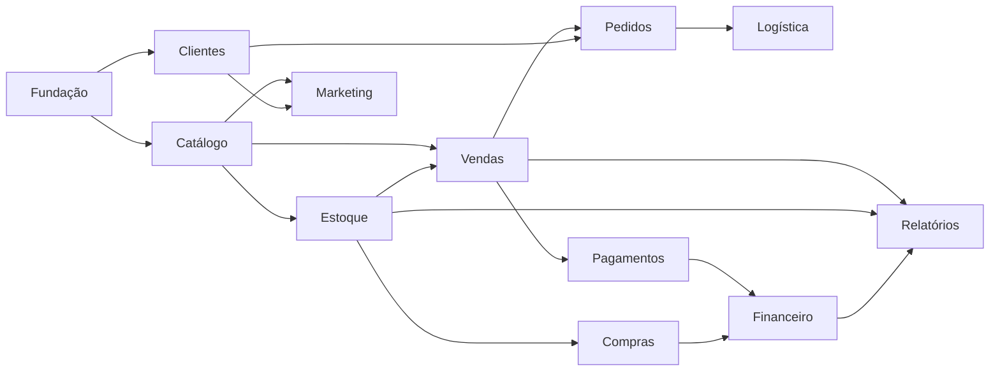
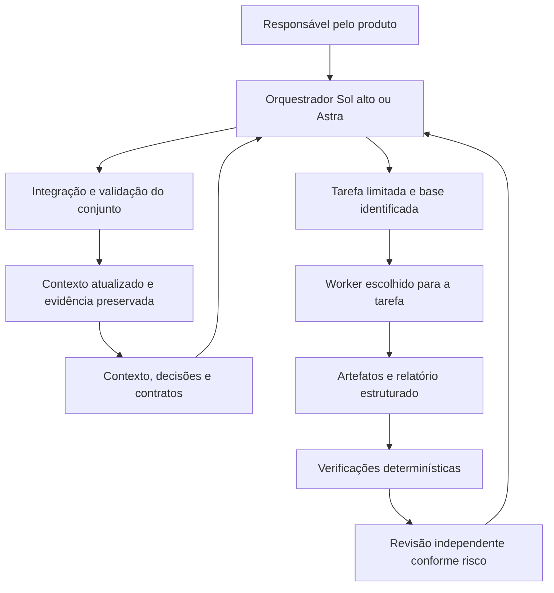

# Plano de arquitetura de desenvolvimento por IA — Comércio 360

Data: 28/09/2026. Versão do plano: 0.1; atualização de implementação em 29/09. **Proposta de operação com H-01 concluída e H-02 parcialmente implantada; piloto e avaliação de qualidade/custo pendentes.**

Histórico de 28/09: Git inicializado sem primeiro commit; ponte DSH MCP registrada e verificada no nível de protocolo. O [diagnóstico da integração](DIAGNOSTICO_DSH_MCP.md) corrige o contrato de transporte da seção 12 para `task`, `cwd`, `timeout_ms`. Em 29/09 foi criado o baseline `5977cdb`, as seis skills e perfis, e o validador local inicial. A cronologia completa da integração DSH (ponte, credenciais, READY, timeouts, EPERM, retrabalho) está na fonte única [HISTORICO_DSH.md](HISTORICO_DSH.md), lida sob demanda; os registros de ausência de Git/ferramenta abaixo descrevem a inspeção original.

Este plano atende ao pedido de estruturar o desenvolvimento antes de programar novos módulos. A aplicação continua em 0.1.1. Não aprova o Catálogo 002, não amplia seu escopo e não altera o parecer H1. As regras abaixo são o desenho proposto para a implantação do harness; não constituem evidência de controles já automatizados.

## 1. Recomendação e objetivo

Adotar um orquestrador Codex, workers com tarefas delimitadas, contratos verificáveis e integração centralizada. Começar com o runtime disponível, documentação versionada e verificações determinísticas; acrescentar automação própria quando o piloto demonstrar uma necessidade concreta.

**Sol com raciocínio alto será o orquestrador habitual. Astra será usado como orquestrador em problemas arquiteturais complexos ou para revisão de alto risco.** Em cada execução há somente um responsável final pela integração. Os modelos não disputam a direção do mesmo pacote.

O objetivo é diminuir retrabalho, perda de decisões e custo por entrega aceita. Multiagentes não eliminam alucinações nem garantem economia. A documentação oficial observa que subagentes também aumentam consumo de tokens e recomenda cautela com escritas paralelas. A decisão de delegar deve considerar ganho de qualidade e tempo, além do custo. [Fonte: subagentes Codex](https://learn.chatgpt.com/docs/agent-configuration/subagents).

## 2. Fontes e estado observado

| Fonte | Uso neste plano |
| --- | --- |
| [context.md](../../context.md) e [AGENTS.md](../../AGENTS.md) | Continuidade e regras locais vigentes |
| [Arquitetura implementada](../architecture/ARQUITETURA.md), [ADR-0009](../adr/ADR-0009-fundacao-identidade-acesso.md) | Contratos atuais de identidade, organização e loja |
| [Base v0.3](../architecture/BASE_v0.3.md), seções 1–14 e 15C | Ambição e sequência de evolução; estados históricos confrontados com documentos posteriores |
| [Decisões do piloto](../DECISOES_PILOTO.md) | Moda/acessórios, uma loja, balcão/WhatsApp e logística por organização |
| [Revisão H1](../REVISAO_ARQUITETURAL_H1.md) | Aprovação com condições e limites de implantação |
| [Proposta do Catálogo](../PACOTE_002_CATALOGO_PROPOSTA.md) | Primeiro pacote comercial ainda sujeito a aceite |
| Código, package.json, duas migrações e testes existentes | Conferência da estrutura efetiva, independente da intenção dos documentos |

O guia externo de continuidade, datado de 24/09, descreve revisão H1 pendente. O parecer de 26/09 atualiza esse estado. Preservar os documentos antigos como histórico. Uma lista de tabelas ou prompt de implementação em documento histórico não é autorização atual para executá-lo.

Conferência desta tarefa: Next 16.3.4, aplicação 0.1.1, domínio puro em `packages/domain`, validação em `packages/validation`, acesso Supabase em `lib`, actions/rotas em `app`, UI em `packages/ui`. A rota genérica ainda apresenta módulos comerciais em construção. Na leitura inicial, a pasta ainda não tinha Git; esse retrato foi superado pela preparação H-04 e pelos commits registrados nos relatórios. A leitura não reexecutou as suítes de aplicação nem consultou o banco remoto.

As evidências existentes continuam sendo 36 PASS hospedados e 90 testes locais/11 E2E documentados na revisão anterior. Não são testes deste harness.

## 3. Mapa da ambição e das decisões ainda abertas

O produto pretende cobrir operação comercial e canais digitais de pequenos e médios varejistas. A arquitetura deve preservar o monólito modular e o PostgreSQL como fonte transacional, introduzindo cada capacidade quando houver um fluxo aceito.

| Área | Estado | Principal contrato ou decisão ainda necessária |
| --- | --- | --- |
| Identidade, empresa, loja e auditoria | Fundação implementada | Administração operacional, provisionamento rastreável, condições H1 e experiência de permissões |
| Catálogo e preços | Proposta 002 | Aceitar campos, papéis, preço por loja, imagem privada, concorrência e reenvio idempotente |
| Estoque | Direção arquitetural | Locais, movimentos, reservas, disponibilidade, inventário, ajuste, transferência e devolução; definir política de saldo negativo |
| Fornecedores e compras | Futuro | Cadastro, pedido, recebimento parcial, custo e vínculo transacional com entrada de estoque |
| Vendas/PDV | Futuro | Carrinho, desconto autorizado, fechamento, cancelamento, troca e devolução; atomicidade e recuperação de falhas |
| Clientes/CRM | Futuro | Identificação, duplicidades, histórico, consentimentos e política de acesso/retenção |
| Pagamentos | Futuro | Provedor/maquininha, estados próprios, idempotência, estorno e conciliação; confirmar recebimento por evidência do provedor |
| Pedidos e atendimento | Futuro | Canais, reservas, separação, entrega/retirada e transições; pedido, pagamento e atendimento têm estados independentes |
| WhatsApp e outros canais | Direção futura | API oficial, permissões, consentimento, templates aplicáveis, webhooks, falhas e reconciliação |
| Entregas/fretes | Futuro | Motorista/veículo exclusivos da organização, cotação, oferta, aceite, ocorrência e comprovante; disputa por aceite e prazos |
| Marketing | Futuro | Calendário primeiro; depois APIs oficiais, permissões, publicação, mensagens e atribuição de resultados |
| Financeiro | Futuro | Caixa, contas, conciliação, custos e margem gerencial; definir fontes e regras antes de exibir valores como reais |
| Relatórios e Visão Geral | Indicadores fictícios hoje | Definição e origem de cada métrica, atualização, escopo por loja e conciliação com operações |
| Fiscal e integrações | Levantamento pendente | Identificar sistema existente, responsabilidades do provedor e contratos de integração; não há emissor próprio aprovado |
| Operação e escala | Parcial | HTTPS, recuperação, produção separada, observabilidade, capacidade, retenção; offline somente após desenho e testes próprios |

Sequência de referência: **Catálogo → Estoque → Compras → PDV → Pedidos → Fretes → Marketing → Financeiro**. Cada item será quebrado em fluxos pequenos. Clientes mínimos, registro de recebimentos e requisitos fiscais poderão ser pré-requisitos do primeiro PDV real, conforme descoberta; não adiar uma dependência necessária só porque o módulo completo está em fase posterior. Relatórios evoluem a partir de dados já operacionais.

Este mapa representa dependências funcionais; não determina datas nem autoriza implementações. Integrações, auditoria e operação são responsabilidades transversais. A separação por módulos não exige um agente permanente para cada módulo.

## 4. Componentes do harness

| Componente | Responsabilidade |
| --- | --- |
| Orquestrador | Interpretar a autorização, manter o objetivo, escolher contexto/modelo, repartir trabalho, resolver dependências e aceitar a integração |
| Worker | Executar uma tarefa finita dentro de arquivos e contratos atribuídos; devolver artefatos, evidências e pendências |
| Skill | Instrução reutilizável de um procedimento específico, com referências opcionais; não é um modelo nem uma permissão de acesso |
| Runtime | Iniciar/retomar agentes, executar ferramentas, aplicar sandbox e expor uso/status conforme as capacidades reais |
| Conector/plugin | Disponibilizar ferramentas externas quando necessárias; não é obrigatório para toda especialidade |
| Avaliação | Validar contrato, alteração, testes e revisão; uma opinião de outro modelo não substitui execução |
| Memória do projeto | Fontes versionadas, contratos e evidências; a conversa ajuda a trabalhar, mas não é o único registro |

A mesma tarefa não deve ser implementada em paralelo por Codex e DeepSeek para depois escolher uma resposta por votação. Comparações de modelos pertencem a avaliações isoladas.

## 5. Agentes iniciais e fronteiras

São seis funções de worker mais o orquestrador. Perfis são reutilizáveis; instâncias são temporárias. Começar com um worker por vez e paralelizar leituras independentes quando houver benefício.

| Perfil | Entrega e propriedade típica | Contexto específico | Limite |
| --- | --- | --- | --- |
| Infra e Dados | Novas migrações, RLS, FKs, RPCs, índices e testes SQL; referências de Storage quando aplicável | Contrato do módulo, migrações relevantes, helpers existentes e testes de isolamento | Não aplicar banco remoto, alterar migração aplicada ou decidir campos de produto sozinho |
| Domínio e Validação | Regras puras, esquemas de entrada, normalização e testes de casos de negócio | Critérios aceitos, exemplos/limites e contratos de entrada/saída | Sem Supabase, rede ou UI dentro do domínio; sem inventar regra para preencher lacuna |
| Aplicação/Backend | Server Actions, consultas, adaptadores, erros e composição autorizada do fluxo | DTOs, RPCs, `requireAccess`, docs Next pertinentes e testes de contratos | Não derivar autorização de cookie ou usar chave administrativa no runtime web |
| Frontend e Acessibilidade | Lista/formulário/detalhe, estados, interação e componentes | Contrato de apresentação, referência visual, navegação e estados de erro | Não definir permissão só na tela; sem mocks em operação real |
| QA e Evidências | Cenários independentes, execução apropriada, falhas reproduzíveis e relatório | Critérios de aceite, alteração candidata, ambiente e comandos de teste | Não alterar regra ou enfraquecer teste para obter PASS; não declarar homologação hospedada com Auth simulado |
| Revisão de Segurança e Arquitetura | Achados reproduzíveis sobre tenant, autorização, concorrência, auditoria, arquivos e limites modulares | Critérios e alteração completa relevante, sem receber o parecer do autor como conclusão | Leitura por padrão; encaminha correções ao autor e não aprova o próprio trabalho |

O orquestrador também desempenha descoberta técnica e curadoria de contexto; não precisa de agentes permanentes adicionais para planejar ou escrever changelog. Um worker pode usar mais de uma skill quando a tarefa realmente cruza procedimentos, mas continua com um objetivo único.

Infraestrutura de implantação deverá ter um perfil de **Operação** antes do primeiro deploy: HTTPS/cookies, ambientes, observabilidade e restauração. **Integrações** ganha perfil próprio quando houver a primeira API externa aceita. **Dados analíticos** surge quando houver métricas reais. Fiscal, pagamentos, logística e marketing recebem referências de domínio específicas quando seus contratos existirem; não criar uma equipe ociosa antecipadamente.

## 6. Roteamento de modelos

As faixas abaixo são hipóteses operacionais do projeto, a calibrar por avaliações. A documentação apresenta Astra para problemas mais difíceis e Sol para trabalho de código/agentes; isso não é um benchmark do Comércio 360. [Fonte: comparação oficial](https://developers.openai.com/api/docs/models/compare).

| Tipo de trabalho | Escolha inicial | Escalar quando |
| --- | --- | --- |
| Orquestração de pacote delimitado | `gpt-6-sol`, high | Contratos conflitantes, dependências amplas ou risco de perda de dados |
| Arquitetura transversal e revisão crítica | `gpt-6-astra`, high | Aumentar esforço apenas se a avaliação exigir; evitar dois orquestradores ativos |
| Domínio, frontend e aplicação com contrato claro | Sol, medium | Exceção ambígua ou falha consistente exige high |
| RLS, transação, auditoria, concorrência e Storage | Sol, high, com revisão independente | Astra para falha sem causa estabelecida ou alteração de fronteira de confiança |
| QA e diagnóstico | Sol, medium/high conforme risco | Causa intermitente, ambiente divergente ou desacordo técnico fundamentado |
| Inventário mecânico/documentação delimitada | Sol, esforço proporcional | Luna é opção futura somente após avaliação, sem assumir menor custo total |
| DeepSeek Harness | Modelo interno a conferir no harness | Não inferir seleção de modelo ou capacidade que a ferramenta não expõe |

Não pedir implementação ao modelo mais barato apenas pelo preço de entrada. Comparar custo total de contexto, saída, revisão, ferramentas e retrabalho. Nenhuma estimativa percentual de economia foi demonstrada nesta tarefa. Tarifas de API não equivalem automaticamente ao consumo de um plano Codex.

O worker não sobe de modelo, muda contratos ou cria subagentes por conta própria. Devolve a causa da dificuldade e a evidência; o orquestrador redistribui ou reduz o escopo. Após duas tentativas de correção sem avanço verificável, interromper a repetição, diagnosticar e replanejar. Um problema de ambiente deve ser corrigido como ambiente antes de trocar o modelo.

## 7. Contexto suficiente com mínimo ruído

Há quatro níveis de informação, carregados conforme a tarefa:

1. **Entrada obrigatória vigente:** `AGENTS.md` e `context.md`. A regra atual exige sua leitura no início de cada tarefa de desenvolvimento, inclusive de workers. `context.md` é mantido como índice enxuto (~metade do tamanho original após a poda de 29/09); não ocultar esse custo nem contornar a regra por um resumo não autorizado.
2. **Contrato do pacote:** escopo aceito, ADR aplicável, critérios e decisões abertas. Referenciar a versão exata; nunca tratar proposta como aceite.
3. **Recorte de execução:** arquivos e símbolos relevantes, interfaces consumidas, migração/consulta correspondente e testes relacionados. Para localizar símbolos, usar o índice estrutural `docs/ai/REPOMAP.md`, gerado por `npm run repomap` (sem dependências novas) e regenerado após mudanças estruturais; ele substitui a varredura de árvore por ~1–2 k tokens de assinaturas. Uma unidade pequena completa costuma ser mais útil que linhas soltas sem imports ou chamadores.
4. **Evidência sob demanda:** logs sanitizados, documentação local do Next, documentação externa oficial e exemplos mínimos de falha. Históricos longos ficam em fonte única e são lidos só quando a tarefa os exige (`docs/ai/HISTORICO_DSH.md` para a integração DSH; relatórios por caso para execuções). Não carregar todos os relatórios históricos por padrão.

Para delegação nativa, preferir sessão sem cópia integral da conversa quando o runtime permitir (`fork_turns="none"` nesta ferramenta). Enviar o contrato e as referências verificáveis. Isso reduz a bagagem da conversa, mas não garante que arquivos/ferramentas herdados sejam inacessíveis. Skill e allowlist textual são controles de procedimento; isolamento efetivo exige suporte de sandbox/runtime.

Meta inicial de tamanho: briefing de 500–1.200 palavras, saída de 300–800 palavras mais evidências estruturadas; referências e artefatos grandes permanecem em arquivo. Essas faixas são alertas de revisão, nunca motivo para truncar um requisito de segurança ou impedir leitura necessária. Medir também os tokens das leituras realizadas, além do prompt inicial.

O worker pode pedir ampliação de contexto com arquivo/símbolo, motivo e dúvida concreta. Deve devolver `needs_context` quando falta contrato, permissão ou dependência essencial. Não deve preencher a lacuna por plausibilidade. Fatos devem apontar fonte; hipóteses e decisões pendentes devem ser explícitas.

`context.md` permanece um índice de estado atual. Detalhes extensos ficam em documento de módulo, ADR e execução. Ao retomar depois de compactação, ler objetivo atual, base, artefatos, verificações concluídas, bloqueios e próxima ação; não repetir exploração completa sem causa.

## 8. Skills a construir

Definir seis skills iniciais, com descrições curtas e gatilhos específicos. O corpo deve conter somente conhecimento do projeto que muda a execução. Referências condicionais carregam os detalhes. Esse desenho acompanha o carregamento progressivo das skills e evita descrições que ativam em qualquer tarefa. [Fonte: skills Codex](https://learn.chatgpt.com/docs/build-skills). Instruções excessivamente prescritivas também devem ser evitadas para Astra. [Fonte: orientação sobre skills e prompts](https://developers.openai.com/blog/rethinking-skills-and-prompts-for-gpt-6-astra).

| Skill proposta | Gatilho/descrição pretendida | Conteúdo particular | Avaliação mínima |
| --- | --- | --- | --- |
| `c360-orquestrar` | Planejar e integrar pacotes de desenvolvimento do Comércio 360 | Estado/autorização, roteamento, dependências, contrato de tarefa, revisão e registro final | Recusar iniciar catálogo sem aceite; não delegar correção trivial; não copiar a árvore inteira |
| `c360-dados` | Criar ou revisar migrações, RPCs e políticas de dados do Comércio 360 | Tenant/FKs, privilégios, auditoria atômica, migração incremental; referência Storage só em tarefas de arquivo | Identificar acesso cruzado, mutação de chave estrutural e migração histórica alterada |
| `c360-dominio` | Implementar regras puras e validações de um módulo aceito do Comércio 360 | Normalização, valores monetários, estados e testes de fronteira; exemplos por módulo | Detectar preço inválido, ausência versus zero e regra de negócio sem decisão |
| `c360-aplicacao` | Implementar ações e adaptadores de servidor do Comércio 360 | SSR, revalidação de acesso, contratos de erro, cache por requisição e docs Next locais | Detectar autorização baseada em cookie e negação incorreta após revogação |
| `c360-interface` | Implementar fluxos de interface do Comércio 360 com contratos já definidos | Padrão visual, estados reais, foco, teclado, pt-BR e larguras 360/768/1440 | Formulário com conflito, erro, acesso negado e envio pendente sem vazamento de dados |
| `c360-verificar` | Validar uma entrega do Comércio 360 por critérios, execução e revisão de risco | Modos QA e revisão independente; evidência sanitizada, ambiente, base e achados | Rejeitar PASS sem execução, teste simulado como prova hospedada e relatório sem base identificada |

Os seis perfis de workers não exigem seis skills distintas: QA e Segurança usam modos diferentes de `c360-verificar` com referências carregadas separadamente. Adicionar `c360-operacao` e `c360-integracoes` quando suas fases forem iniciadas.

As seis skills específicas do projeto foram criadas em `.agents/skills/c360-*/SKILL.md` em 29/09. A documentação atual do Codex confirma discovery nessa pasta; a sintaxe e a estrutura foram conferidas localmente, mas a seleção efetiva em uma nova sessão ainda precisa de observação. Perfis de agentes foram criados em `.codex/agents/*.toml`, formato documentado para agentes de projeto. A sintaxe TOML passou; isso não prova que cada perfil foi iniciado. `agents/openai.yaml` de uma skill é metadado de interface/dependências, não um worker em execução.

Antes de ativar: validar frontmatter e referências, testar gatilhos positivos e negativos, executar cenários de comportamento em cópia descartável e conferir discovery no runtime. Validação sintática sozinha não comprova a qualidade da skill. Esta entrega especifica as skills; não cria nem instala seus arquivos executáveis.

## 9. Contratos e comunicação

O [contrato operacional](CONTRATOS_HARNESS.md) define os campos da tarefa, do resultado, da revisão e do checkpoint. Há um validador local inicial para envelope/resultado em `scripts/harness/validate.mjs`, com limites documentados; dispatcher e aceite semântico continuam manuais.

Toda tarefa precisa de objetivo observável, base identificada, autorização, arquivos de leitura/escrita, invariantes, dependências, critérios, verificações, modelo e condições de parada. A saída precisa de alterações, evidências, status, hipóteses, riscos e solicitações de contexto. O autor pode declarar trabalho pronto para revisão, mas só o orquestrador marca a integração como aceita.

Não encaminhar ao orquestrador transcrições de ferramentas ou raciocínio interno. Encaminhar conclusão técnica curta, justificativa verificável e referências ao artefato completo. Erros relevantes não podem desaparecer no resumo.

Mudanças de contrato voltam ao orquestrador antes de produtores e consumidores divergirem. Uma mudança de requisito aceita gera nova revisão do contrato, invalida tarefas dependentes afetadas e provoca revalidação direcionada.

## 10. Concorrência e integração

**Condição atualizada em 29/09: Git inicializado com baseline local `5977cdb`; manter um único escritor por tarefa até ensaiar worktrees e integração.** Leituras paralelas só contam como revisão da entrega quando a base estiver estável e identificada. Relatórios produzidos sobre arquivos mudando devem ser refeitos para os arquivos afetados.

Na preparação do harness, estabelecer Git local, exclusões de segredos/artefatos, baseline e comparação antes de habilitar múltiplos escritores. Não há criação/publicação de repositório remoto nesta proposta. Depois, usar worktrees isolados a partir da mesma base e integração serial pelo orquestrador, com validação após integração.

Cada arquivo tem um dono por tarefa. `package.json`, lockfile, navegação, exports compartilhados, numeração de migrações e documentos de continuidade são pontos de integração atribuídos explicitamente. Workers propõem mudanças nesses pontos quando não forem seus donos. Dois worktrees não resolvem sozinhos conflitos semânticos em contratos.

O runtime desta sessão oferece quatro slots, incluindo o principal. É um limite observado, não uma garantia futura. Proposta: começar com um worker; evoluir para até dois workers independentes e reservar capacidade para revisão. Não criar árvore recursiva de delegação. Testes que usam as mesmas portas, diretórios `.next` ou banco não executam simultaneamente no mesmo ambiente.

## 11. Fluxo de avaliação e aceite

1. **Elegibilidade:** requisito autorizado, contrato suficiente, base conferida e ambiente identificado. Proposta sem aceite pode gerar análise, não implementação.
2. **Execução:** worker modifica apenas o escopo atribuído e executa verificações proporcionais. Registra impedimentos de ambiente como tais.
3. **Validação estrutural:** controlador confere relatório, arquivos tocados, integridade da base e evidências. Rejeita saída malformada, mudança fora do escopo e artefato ausente.
4. **Revisão independente:** outro contexto examina critérios e alteração. Para autenticação, RLS, transações, dinheiro, auditoria, Storage e integrações, exigir revisão específica de risco. Não expor a conclusão do autor como resposta esperada.
5. **Integração:** orquestrador resolve achados, integra a alteração e valida o conjunto. Resultado de worker isolado não substitui verificação integrada.
6. **Continuidade:** atualizar contexto, decisões e entrega com o que foi realmente executado. Somente então encerrar o pacote correspondente.

Para mudanças funcionais, o fechamento do pacote mantém os gates existentes de lint, tipos, testes e build; E2E cobre os fluxos afetados e os gates exigidos pela especificação. Workers executam primeiro seus testes direcionados; o conjunto necessário roda sobre a integração final. Mudança apenas documental recebe conferência de links, coerência e integridade, sem alegar novo PASS de aplicação.

Resultado obrigatório não executado impede declarar aquele gate concluído. Quebra de isolamento, exposição de segredo, perda de auditoria ou integridade é impeditiva, mesmo com outros testes passando. Ausência de achado de um revisor não prova ausência de defeito. Divergências são resolvidas por requisito, código e reprodução; persistindo incerteza material, registrar bloqueio e escalar.

Ambientes ficam explícitos: domínio/SQL local, PGlite, Auth simulado, navegador local, Supabase descartável e HTTPS da aplicação são evidências distintas. Preservar os arquivos H1 originais.

## 12. Caminho DeepSeek e recursos disponíveis

Contrato efetivo da ponte local (fatos duráveis em [HISTORICO_DSH.md](HISTORICO_DSH.md) e [DIAGNOSTICO_DSH_MCP.md](DIAGNOSTICO_DSH_MCP.md)): `dsh_delegate` aceita somente `task` (objetivo + contexto + arquivos permitidos + invariantes + critérios + verificações, ≤ 20.000 caracteres), `cwd` obrigatório e `timeout_ms` entre 1000 e 600000. Não aceita `context`, `sandbox` ou `max_iterations`; não impõe 25 iterações. A allowlist limita a raiz de lançamento ao Comércio 360 e **não é sandbox** — isolamento de ferramentas pertence ao perfil DSH. `dsh_health` confirma versão, perfil e workspaces permitidos. O stderr do headless é drenado sem encaminhamento; falhas devolvem códigos sanitizados. A skill local contém referências a outro projeto (DC Log Express) que não se aplicam e não entram no briefing.

Estado em 30/09: H-03 e H-04 sintético encerrados, com runner E2E original pendente. A ponte G capturou tokens reais do turno raiz DSH e duração, com JSONL correspondente. [TELEMETRIA_G.md](TELEMETRIA_G.md) define fonte, escopo e campos `null`. Custo segue indisponível; não iniciar novos pares de custo ainda. Cronologia: [HISTORICO_DSH.md](HISTORICO_DSH.md). Credenciais, tokens, senhas e operações que exijam manuseá-los não são delegados ao DSH; um prompt restritivo não revoga acesso herdado — inspecionar as ferramentas reais do runtime.

## 13. Medir qualidade e custo

Registrar por tarefa: identificador, contrato/base, worker, modelo e esforço efetivamente usados, duração, chamadas, tentativas, arquivos, verificações, achados, aceitação e uso disponível. Tokens de entrada, saída, cache e raciocínio só recebem números quando a telemetria os fornecer. Estimativas de texto ficam rotuladas; não equivalem a faturamento.

Métricas: custo total por tarefa aceita; aceitação na primeira revisão; retrabalho; defeitos encontrados após aceite; violações de escopo; contexto adicional solicitado; tempo total e tempo aguardando dependência. Incluir orquestração, leituras, workers e revisões no custo. Qualidade e preservação das invariantes têm prioridade sobre reduzir tokens isoladamente.

Avaliação inicial em cópias descartáveis da mesma base: tarefa delimitada de domínio, cenário SQL/tenant e fluxo de UI. Comparar execução única com execução delegada para os mesmos critérios, registrando configurações e variabilidade. Defeitos semeados ficam apenas nas cópias de avaliação. Não usar tarefas com dados reais como benchmark. Só promover modelo mais barato ou maior paralelismo se a qualidade for preservada e houver benefício observado.

## 14. Implantação em etapas

| Etapa | Entregável | Critério de conclusão |
| --- | --- | --- |
| H-01 — Base de trabalho | Versionamento local, exclusões, baseline e inventário de ferramentas | Diff confiável e fontes/segredos separados; sem publicação remota implícita |
| H-02 — Contratos e skills | Seis skills, perfis suportados e validação dos contratos | Discovery real e validação sintática/semântica; contextos sem dependências alheias |
| H-03 — Piloto controlado | Uma tarefa de baixo risco e revisão em contexto independente | Artefato verificável, status honesto e integração sem mudança fora do escopo |
| H-04 — Avaliação comparativa | Três casos representativos e métricas | Registrar resultados, falhas e decisão fundamentada de roteamento |
| H-05 — Operação assistida | Workers aplicados a um pacote aceito | Integração e gates do pacote atendidos; custo e limitações observáveis |
| H-06 — Automação necessária | Dispatcher, validador, ledger ou conector quando justificados | Automatizar dificuldade comprovada sem criar um produto paralelo maior que o fluxo |

Na H-02, começar com roteamento manual pelo orquestrador e relatório em arquivo. Automatizar validação de contrato antes de alegar que ele é rígido por enforcement; até lá, a conferência é manual. Não adicionar fila, banco vetorial, RAG global, serviço distribuído ou assinatura externa sem uma necessidade demonstrada.

Cada etapa aproveita a autorização já dada para seu escopo. Esclarecimentos ficam restritos a decisões de produto, acesso necessário e mudanças fora do escopo autorizado. A criação deste plano não equivale à implantação completa do harness.

## 15. Exemplo futuro: Catálogo 002

Este exemplo fica condicionado ao aceite próprio da proposta e ao ADR do catálogo. Ele não inicia desenvolvimento comercial.

| Ordem | Trabalho | Dono e dependência |
| --- | --- | --- |
| 0 | Aceitar regras, papéis, preço por loja e imagem; fechar contratos e ADR | Produto + orquestrador |
| 1 | Modelar entradas, valores, erros, concorrência e idempotência | Domínio; revisão de Dados antes de estabilizar contrato |
| 2 | Implementar migração/RPCs/RLS e testes SQL | Dados; usa contrato estabilizado |
| 3 | Criar actions/adaptadores e leituras autorizadas | Aplicação; depende do contrato de domínio e banco |
| 4 | Construir lista, busca, detalhe e formulários | Frontend; pode preparar componentes contra DTO aceito, mas integração depende da etapa 3 |
| 5 | Implementar ciclo de capa privada, substituição e falhas | Dados + Aplicação em tarefas distintas e coordenadas; sem dois donos no mesmo arquivo |
| 6 | Exercitar fluxo, acesso cruzado, revogação e falhas | QA; revisão independente de Segurança sobre versão estável |
| 7 | Validar conjunto e produzir entrega/homologação própria | Orquestrador e operador conforme necessidade administrativa |

Um recorte vertical útil para o primeiro ensaio é produto com variante inicial e consulta autorizada. As demais capacidades continuam obrigatórias se fizerem parte do pacote aceito; dividir em tarefas não reduz os critérios de aceite.

## 16. Estado de entrega deste plano

Entregues até 29/09: mapa do produto, topologia, seis perfis TOML, seis skills de projeto, roteamento inicial, política de contexto, contratos documentais, validador local inicial com testes negativos, sequência de implantação, baseline Git `5977cdb`, piloto H-03 integrado em `4a80096` e a **tríade de mitigação de tokens** aprovada no [diagnóstico](DIAGNOSTICO_TOKENS.md): poda do `context.md`, fonte única DSH ([HISTORICO_DSH.md](HISTORICO_DSH.md)), [RepoMap](REPOMAP.md) sem dependências (`npm run repomap`), índice leve dos JSONs H-04 ([H04_RESULTADOS_INDICE.md](H04_RESULTADOS_INDICE.md)) e contratos de testes externos, pacote de revisão e retomada por delta ([CONTRATOS_HARNESS.md](CONTRATOS_HARNESS.md) §7–§8). Atualizados os apontadores de continuidade.

Estado em 30/09: H-04 sintético encerrado com D1/S1 e U1 revisados; U1-V5 externo passou 6/6 nos dois braços, enquanto o runner original U1-V1 mantém FAIL Codex e `not_run` DSH. A ponte G capturou uso real do DSH e a suíte harness passou 16/16. Tokens do Codex por tarefa, cobertura de subagentes e custo comparável continuam indisponíveis. Confirmar perfis/skills em sessão nova e as verificações semânticas restantes do contrato. Nenhuma capacidade comercial, dependência de aplicação ou migração foi adicionada. Fontes: [RELATORIO_H04.md](RELATORIO_H04.md), [TELEMETRIA_G.md](TELEMETRIA_G.md).

Próximo trabalho: definir captura por tarefa da rota Codex, subagentes e orquestração antes de novos pares de custo. Reparar o runner E2E original em trabalho próprio. Catálogo 002 depende de aceite e ADR; as condições H1 seguem abertas para publicação e dados reais.
