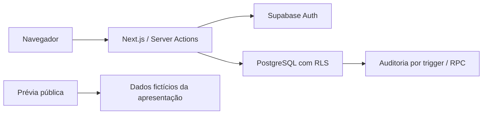

# Arquitetura implementada — fundação 0.1.1

Atualização de estado em 26/09/2026: **revisão H1 aprovada com condições para continuidade do desenvolvimento**, conforme [parecer atual](../REVISAO_ARQUITETURAL_H1.md). A evidência hospedada original mantém 36 PASS e seu status histórico. A [proposta do Pacote 002](../PACOTE_002_CATALOGO_PROPOSTA.md) está disponível para aceite; não há módulo comercial implementado. Login anônimo ainda não conferido pelo operador, HTTPS/cookies, recuperação e produção separada continuam pendentes. O registro técnico abaixo conserva a descrição histórica da implementação, sem mudança de contratos ou migrações.

Data: 08/09/2026. Escopo: Pacote 001 com corretivo 001.1. A [base inicial v0.1](BASE_v0.1.md) e a [revisão fornecida v0.3](BASE_v0.3.md) foram preservadas. A revisão local do Pacote 001 foi aprovada na base v0.3; este registro descreve as correções implementadas, sem declarar homologação H1 nem aprovar etapas futuras.

Monólito modular Next.js com App Router. Uma aplicação no diretório raiz substitui `apps/web`, simplificação expressamente permitida pela seção 6 da base. Domínio, validação, UI, configuração, mocks e infraestrutura têm pastas distintas. Nenhuma dependência do Supabase ou de mocks entra no domínio.

Autenticação usa `@supabase/ssr`, cookies e `getUser()` no servidor. O proxy renova cookies; as páginas e Server Actions revalidam acesso, sem depender apenas do layout/proxy. As consultas usam chave pública e contexto do usuário, nunca chave privilegiada. Não há credenciais de serviço no runtime web.

No 001.1, `requireAccess` usa `React.cache` para evitar consultas repetidas por layout e página na renderização da mesma requisição. Não há cache persistente de sessão, de usuários ou de permissões entre requisições.

`organizations` é a raiz e usa seu próprio `id` como tenant. `profiles` é identidade global com chave externa para `auth.users`; não contém credenciais nem perfil de autorização global. `memberships` associa usuário, organização, papel e estado ativo. `user_store_access` associa o vínculo a lojas da mesma organização. Proprietários e gerentes também precisam de acesso explícito à loja. Essas exceções estruturais à frase genérica “todas as tabelas têm organization_id” são detalhadas no ADR-0009.

RLS está habilitada em todas as seis tabelas públicas. `anon` não lê dados. `authenticated` recebe somente SELECT e EXECUTE na RPC específica de seleção de loja. Memberships/perfis/acessos são visíveis apenas ao próprio usuário; eventos de auditoria exigem vínculo e, quando houver, loja autorizada. Gerentes/proprietários veem a auditoria nesse escopo; outros papéis veem seus próprios eventos. Funções internas têm `search_path` fixo e privilégios mínimos.

A troca de loja valida autorização e grava evento com ator derivado da sessão no banco antes de salvar cookies HTTP-only. Cookie adulterado nunca amplia acesso; contexto inválido é substituído pela primeira loja atualmente autorizada. Seleção repetida da mesma loja não duplica o último evento. Ao trocar de empresa, identificadores da empresa anterior não são copiados para a auditoria da seguinte.

O seletor agora lista somente organizações com ao menos uma loja ativa autorizada. Vínculo ativo sem loja na organização não libera operação e não gera opção vazia no seletor. Se houver outra organização com loja, ela permanece utilizável; sem qualquer loja, redireciona para `/sem-acesso`. A política de leitura de organizações no banco permanece baseada em vínculo: a seleção operacional é um subconjunto desses dados, derivado das lojas filtradas por RLS.

Triggers registram criação e alteração de organizações, lojas, vínculos e acessos, incluindo antes/depois e origem. Auditoria é append-only inclusive para atualizações acidentais por serviço. Identidades globais não geram um evento de negócio sem organização; auditoria de credenciais pertence ao Supabase Auth.

A migração incremental `202609080001_tenant_key_guards.sql` bloqueia mudanças em `organizations.id`, `stores.(id,organization_id)`, `memberships.(id,organization_id,user_id)` e `user_store_access.(id,organization_id,membership_id,store_id)`. Inclui updates normais com `service_role`, mesmo em registros sem referências ou desativados. Não altera as seis tabelas em módulos comerciais nem introduz transferência funcional: desative/recrie registros; revogue/remova e recrie acessos. Campos operacionais existentes continuam editáveis e updates idênticos preservam a idempotência do seed.

Uma restrição adicional impede snapshots de auditoria que declarem outra organização, incluindo o `id` raiz de snapshots de `organizations`. O histórico também é validado; inconsistências preexistentes interrompem a migração transacional e exigem investigação. Não há exclusão ou correção silenciosa da auditoria.

O script administrativo de seed valida flag de desenvolvimento, confirmação independente da origem do projeto e domínio exato `example.test` de todas as contas antes da primeira chamada HTTP. `CONFIRM_SUPABASE_PROJECT_URL` é informado no ambiente do operador; `.env.example` permanece sem alterações e não contém credenciais novas.

O painel demonstra a futura operação; não lê indicadores comerciais do banco. As onze abas futuras, inclusive a interface administrativa de Configurações, exibem estado Em construção. O provisionamento da fundação é administrativo, via seed/API confiável. Busca global, editor de papéis, PDV, estoque transacional, fiscal, pagamentos, logística e marketing não foram implementados.

Estados de pedido/pagamento/atendimento/frete/oferta permanecem definidos pela base e não foram modelados antecipadamente. Também não há fila, integrações externas operacionais ou funcionamento offline neste pacote.

Validação local: migrações reais em PGlite, testes de contrato SSR com API de autenticação simulada, preflight do seed e navegação Chromium. Os resultados históricos do corretivo estão em `docs/ENTREGA.md`. A homologação hospedada está em `docs/ENTREGA_H1.md`; os resultados locais reexecutados e as condições do parecer atual estão em `docs/REVISAO_ARQUITETURAL_H1.md`.

Referências consultadas: [autenticação Next.js](https://nextjs.org/docs/app/guides/authentication), [Supabase SSR](https://supabase.com/docs/guides/auth/server-side), [RLS Supabase](https://supabase.com/docs/guides/database/postgres/row-level-security), [RLS PostgreSQL](https://www.postgresql.org/docs/current/ddl-rowsecurity.html).
