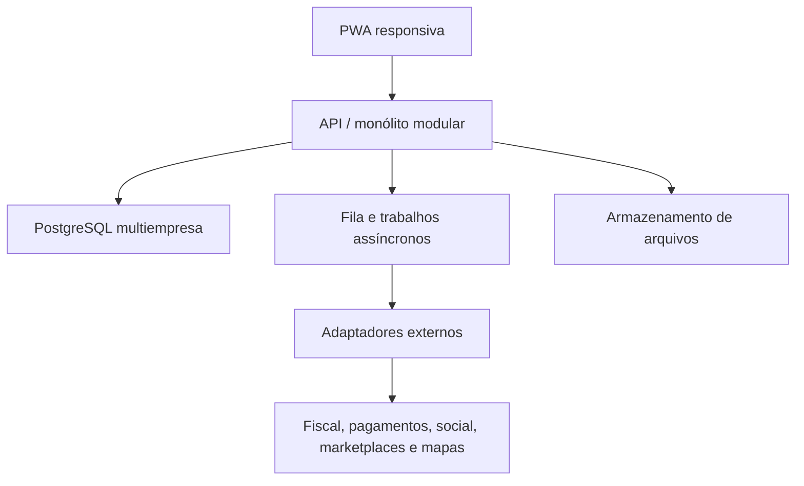

# Projeto Comércio 360 — Arquitetura Viva

**Versão:** 0.3  
**Data-base:** 08/09/2026  
**Responsável pela arquitetura e revisão:** ChatGPT Work  
**Responsável pela implementação:** GPT Desktop  
**Status:** Pacote 001 aprovado na revisão técnica local, com Pacote corretivo 001.1 antes da homologação; Supabase hospedado, nome comercial e nicho-piloto ainda pendentes

> Este é o registro principal do projeto. Deve ser atualizado sempre que uma decisão alterar módulos, dados, integrações, segurança, infraestrutura ou fluxo operacional.

## 1. Visão do produto

Construir um sistema operacional omnichannel para pequenos e médios comerciantes do varejo de rua. O produto deverá reunir, em uma experiência única e simples:

- vendas no balcão e pedidos de canais digitais;
- catálogo, preços e promoções;
- controle de estoque por loja/local;
- compras e fornecedores;
- clientes e relacionamento;
- solicitação de fretes e oferta para motoristas cadastrados;
- planejamento e operação de mídias sociais;
- financeiro gerencial e indicadores;
- administração, integrações e auditoria.

O sistema será simples na superfície e rigoroso internamente. “Consultar tudo em uma tela” será atendido por um painel central com indicadores, alertas, tarefas e busca global, sem colocar todas as funções simultaneamente na mesma página.

## 2. Posicionamento arquitetural

O produto será formado por:

1. **Núcleo comum:** recursos presentes em quase todo varejo: empresas, lojas, usuários, produtos, estoque, vendas, clientes, fornecedores e relatórios.
2. **Módulos opcionais:** logística própria/parceira, marketing social, fiscal, marketplace e recursos avançados.
3. **Configurações por nicho:** atributos, unidades, variações e regras específicas sem duplicar o sistema.

Exemplos:

- Moda: tamanho, cor, coleção e troca.
- Autopeças: aplicação, marca, modelo e ano.
- Cosméticos: lote, validade e variações.
- Materiais de construção: unidade, peso, volume e entrega programada.

**Hipótese recomendada para o primeiro piloto:** moda e acessórios em uma loja de rua do ABCDM. É um nicho conhecido pelo responsável do projeto e permite validar variantes, estoque, venda, troca e comunicação digital. Essa hipótese ainda precisa de aprovação.

## 3. Princípios que não podem ser quebrados

1. **Uma única fonte de verdade:** PostgreSQL será o banco transacional principal. Sheets poderá importar, exportar ou apoiar protótipos, mas não controlará o estoque oficial.
2. **Multiempresa desde o início:** todos os registros de negócio pertencem a uma organização e, quando aplicável, a uma loja.
3. **Estados separados:** pedido, pagamento, atendimento, frete e oferta ao motorista terão estados independentes.
4. **Estoque por movimentos:** entradas, saídas, reservas, ajustes, transferências e devoluções serão registradas; o saldo será consequência desses movimentos.
5. **Auditoria:** mudanças sensíveis registrarão usuário, data, origem, valor anterior e valor posterior.
6. **Integrações desacopladas:** redes sociais, pagamentos, fiscal, marketplaces e transportes serão conectados por adaptadores, webhooks e filas.
7. **Idempotência:** webhooks, pagamentos, importações e sincronizações repetidas não poderão duplicar operações.
8. **Segurança por padrão:** menor privilégio, isolamento por organização, segredos fora do código e proteção de dados pessoais.
9. **Evolução modular:** começar com um monólito modular; separar serviços somente quando volume ou operação comprovarem a necessidade.
10. **Entrega por etapas:** nenhuma fase inicia sem critérios de aceite e registro do que mudou.

## 4. Estrutura de navegação

| Aba | Objetivo | Prioridade |
| --- | --- | --- |
| Visão Geral | KPIs, alertas, tarefas, vendas, estoque crítico, pedidos e entregas | MVP |
| Vendas / PDV | Venda rápida, orçamento, desconto autorizado, pagamento, troca e devolução | MVP |
| Pedidos | Unificar balcão, WhatsApp, site e futuros marketplaces | MVP parcial |
| Produtos | Catálogo, variantes, códigos, preços e imagens | MVP |
| Estoque | Saldo, reservas, movimentos, inventário e transferência | MVP |
| Compras / Fornecedores | Cadastro, pedido de compra, recebimento e custo | MVP |
| Clientes / CRM | Cadastro, histórico, consentimentos e relacionamento | MVP básico |
| Entregas / Fretes | Solicitação, cotação, motorista, oferta, aceite, rota e POD | Fase 3 |
| Marketing | Calendário, campanhas, publicações, mensagens e resultados | Fase 4 |
| Financeiro | Caixa, contas, conciliação e margem gerencial | Fase 5 |
| Relatórios | Vendas, giro, ruptura, margem, fornecedores, logística e campanhas | Evolutivo |
| Configurações | Empresa, lojas, usuários, permissões, nicho e integrações | Fundação |

No celular, a navegação exibirá apenas as ações do perfil. O motorista terá uma experiência dedicada dentro do mesmo ecossistema, otimizada para oferta, aceite, rota, ocorrência e comprovante de entrega.

## 5. Experiência da tela central

A tela inicial deve responder rapidamente a cinco perguntas:

1. Quanto vendi hoje?
2. Quais pedidos exigem ação?
3. Quais produtos estão em ruptura ou abaixo do mínimo?
4. Quais compras, entregas ou pagamentos estão atrasados?
5. Qual ação gera maior impacto agora?

Componentes previstos:

- seletor de organização, loja e período;
- busca global por produto, pedido, cliente, fornecedor, NF ou entrega;
- KPIs configuráveis por perfil;
- central de pendências e exceções;
- ações rápidas;
- agenda operacional;
- feed de eventos auditáveis;
- atalhos com teclado no desktop e navegação simplificada no celular.

## 6. Arquitetura técnica recomendada



### Stack-base

- **Frontend e aplicação web:** Next.js com TypeScript, responsivo e instalável como PWA.
- **Banco, autenticação e arquivos no MVP:** Supabase/PostgreSQL, com políticas de Row-Level Security.
- **Validação:** esquemas compartilhados entre formulário, API e domínio.
- **Processos assíncronos:** fila para webhooks, publicações, importações, notificações e retentativas.
- **Observabilidade:** logs estruturados, rastreio de erros e métricas de negócio.
- **Testes:** unidade para regras, integração para banco/API e ponta a ponta para fluxos críticos.

Essa escolha reduz infraestrutura inicial sem prender o domínio ao fornecedor. Regras de negócio permanecerão em módulos próprios; chamadas externas ficarão atrás de interfaces/adaptadores.

### Estrutura inicial do repositório

```text
apps/web
packages/domain
packages/ui
packages/validation
packages/config
supabase/migrations
supabase/tests
docs/adr
docs/architecture
```

Se a implementação inicial usar apenas uma aplicação Next.js, os limites acima continuam obrigatórios mesmo que algumas pastas sejam simplificadas.

## 7. Módulos de domínio

| Módulo | Responsabilidade | Depende de |
| --- | --- | --- |
| Identity | autenticação, perfis e sessões | Fundação |
| Tenancy | organização, loja, plano e contexto ativo | Identity |
| Catalog | produtos, variantes, categorias, preço e mídia | Tenancy |
| Inventory | locais, movimentos, reservas e inventário | Catalog |
| Procurement | fornecedores, pedidos e recebimentos | Catalog, Inventory |
| Sales | carrinho, venda, itens, desconto e devolução | Catalog, Inventory |
| Payments | cobranças, recebimentos, estornos e conciliação | Sales |
| Customers | cadastro, histórico e consentimentos | Tenancy |
| Orders | ciclo omnichannel e atendimento | Sales, Customers |
| Logistics | frete, motorista, veículo, oferta, rota e entrega | Orders |
| Marketing | canais, conteúdo, campanha, lead e atribuição | Catalog, Customers |
| Reporting | métricas e projeções de leitura | Todos |
| Integrations | credenciais, webhooks, sincronização e falhas | Fundação |
| Audit | eventos sensíveis e rastreabilidade | Todos |

## 8. Modelo de dados inicial

Todas as tabelas de negócio terão `id`, `organization_id`, `created_at` e `updated_at`. As que variam por unidade terão também `store_id`.

### Fundação

- `organizations`
- `stores`
- `users`
- `memberships`
- `roles`
- `permissions`
- `user_store_access`
- `audit_events`
- `integration_accounts`
- `webhook_events`

### Comercial e estoque

- `products`
- `product_variants`
- `categories`
- `price_lists`
- `price_list_items`
- `inventory_locations`
- `stock_movements`
- `stock_reservations`
- `inventory_counts`
- `suppliers`
- `purchase_orders`
- `purchase_order_items`
- `receipts`

### Venda e relacionamento

- `customers`
- `customer_consents`
- `sales_orders`
- `sales_order_items`
- `payments`
- `refunds`
- `returns`
- `sales_channels`

### Logística

- `drivers`
- `vehicles`
- `driver_availability`
- `freight_requests`
- `freight_quotes`
- `route_offers`
- `route_events`
- `shipments`
- `deliveries`
- `delivery_occurrences`
- `delivery_proofs`

### Marketing

- `social_accounts`
- `content_items`
- `publishing_jobs`
- `campaigns`
- `leads`
- `customer_interactions`
- `attribution_events`

## 9. Estados obrigatoriamente separados

### Pedido

- `order_status`: `DRAFT`, `CONFIRMED`, `CANCELED`, `CLOSED`.
- `payment_status`: `PENDING`, `AUTHORIZED`, `PAID`, `PARTIAL`, `REFUNDED`, `FAILED`.
- `fulfillment_status`: `UNALLOCATED`, `RESERVED`, `PICKING`, `READY`, `SHIPPED`, `DELIVERED`, `RETURNED`.

### Logística

- `freight_status`: `DRAFT`, `PRICED`, `ROUTED`, `OFFERING`, `ASSIGNED`, `IN_TRANSIT`, `DELIVERED`, `CANCELED`.
- `route_offer_status`: `CREATED`, `NOTIFIED`, `VIEWED`, `ACCEPTED`, `REJECTED`, `EXPIRED`, `CANCELED`.

Essa separação incorpora diretamente o aprendizado do FluxTMS: uma rota roteirizada não significa que o motorista foi notificado, e uma notificação não significa aceite.

## 10. Perfis e permissões

Perfis iniciais:

- proprietário;
- gerente;
- vendedor/caixa;
- estoquista;
- comprador;
- marketing;
- logística;
- motorista parceiro;
- administrador da plataforma.

A autorização será baseada em ação e escopo, não somente no nome do perfil. Exemplo: `inventory.adjust` poderá ser autorizado para um gerente em uma loja específica, mas não para todas as lojas da empresa.

## 11. Integrações e limites de escopo

### Fiscal

O sistema armazenará dados fiscais e o vínculo com documentos, mas a emissão de NFC-e/NF-e deverá ser realizada por um provedor fiscal especializado. As especificações oficiais continuam recebendo notas técnicas e mudanças relacionadas à reforma tributária; portanto, codificar um emissor fiscal próprio no MVP aumentaria risco e custo.

### Mídias sociais

A primeira versão do módulo será um calendário editorial e central de campanhas. Publicação, comentários e mensagens só serão ativados por APIs oficiais e conforme as permissões de cada conta. Tokens ficarão criptografados e nunca serão gravados no navegador ou no repositório.

### WhatsApp

O sistema deverá tratar mensagens e notificações como integração, com consentimento, templates quando exigidos, webhooks idempotentes e rastreabilidade. Não fará automação por navegador.

### Pagamentos

Operações usarão identificador idempotente, status próprio e conciliação. Dados completos de cartão não serão armazenados.

### Apps Script e Sheets

Os componentes existentes poderão servir como ponte de importação/exportação e referência funcional. Novos módulos transacionais não deverão depender de uma planilha como banco principal.

## 12. Requisitos não funcionais iniciais

- isolamento comprovado entre organizações;
- trilha de auditoria para estoque, descontos, cancelamentos, permissões e pagamentos;
- backups e procedimento de restauração testável;
- respostas idempotentes para webhooks e operações críticas;
- acessibilidade por teclado, contraste e rótulos claros;
- carregamento da tela principal com estados de `loading`, vazio e erro;
- funcionamento em desktop e celular;
- nenhuma credencial no repositório;
- migrações de banco versionadas e reversíveis quando possível;
- logs sem dados pessoais desnecessários;
- política de retenção e atendimento aos direitos do titular conforme a LGPD.

## 13. Roadmap saudável por etapas

| Etapa | Objetivo | Saída verificável |
| --- | --- | --- |
| 0 — Descoberta | escolher nicho, loja-piloto e fluxos críticos | mapa do processo e critérios do MVP |
| 1 — Fundação | repositório, autenticação, empresa, loja, perfis, layout e auditoria-base | usuário entra e vê apenas sua organização/loja |
| 2 — Núcleo comercial | catálogo, variantes, estoque, fornecedores e venda básica | venda reduz estoque com rastreabilidade |
| 3 — Omnichannel e logística | pedidos, separação, frete, oferta e entrega | pedido percorre venda até POD |
| 4 — Marketing | calendário, campanhas e integrações sociais aprovadas | campanha vinculada a conteúdo e resultados |
| 5 — Financeiro e gestão | caixa, conciliação, margem e relatórios | visão gerencial confiável por loja |
| 6 — Escala | marketplaces, automações, inteligência e otimização | expansão com métricas e SLOs definidos |

Cada etapa será dividida em sprints curtas. Não será permitido iniciar todas as abas ao mesmo tempo.

## 14. Governança do desenvolvimento

### Papéis

- **Arquiteto/PO técnico (este chat):** define contexto, contratos, prioridade, riscos e critérios; revisa entregas e atualiza este documento.
- **Desenvolvedor (GPT Desktop):** implementa somente o pacote de trabalho aprovado, documenta decisões e executa verificações.
- **Responsável do produto (Alexsandro):** valida o fluxo real do comerciante, escolhe prioridades e aprova o que atende à operação.

### Arquivos obrigatórios no repositório

- `docs/architecture/ARQUITETURA.md` — estado atual do sistema;
- `docs/adr/ADR-XXXX-titulo.md` — decisões estruturais;
- `CHANGELOG.md` — alterações entregues;
- `README.md` — instalação e comandos;
- `.env.example` — nomes das configurações, sem segredos.

### Regra de atualização

Uma mudança de arquitetura deve registrar:

1. problema e contexto;
2. decisão tomada;
3. alternativas avaliadas;
4. impacto nos módulos e dados;
5. migração necessária;
6. risco e forma de reversão;
7. data e versão.

### Definition of Done

Uma tarefa somente estará concluída quando:

- requisito e critério de aceite forem atendidos;
- lint, tipos, testes e build estiverem aprovados;
- migrações e políticas de acesso tiverem testes;
- estados vazio, carregando e erro existirem;
- documentação e changelog estiverem atualizados;
- não houver segredo ou dado pessoal de teste no código;
- a revisão do arquiteto não identificar quebra de contrato.

## 15. Pacote de trabalho 001 para o GPT Desktop

### Objetivo

Criar somente a fundação executável do sistema. Não implementar ainda PDV completo, emissão fiscal, integrações sociais, pagamentos reais ou roteirização.

### Entregáveis

1. Aplicação Next.js + TypeScript com estrutura modular.
2. Layout responsivo autenticado com barra lateral e as abas previstas.
3. Tela Visão Geral com dados simulados, incluindo loading, vazio e erro.
4. Fundação PostgreSQL/Supabase para:
   - organizações;
   - lojas;
   - perfis de usuário/membros;
   - acesso do usuário às lojas;
   - eventos de auditoria.
5. Migrações versionadas.
6. Políticas RLS e testes provando que um usuário da organização A não acessa dados da organização B.
7. Seed exclusivamente fictício para duas organizações.
8. README, `.env.example`, changelog e primeiro ADR.
9. Scripts de `lint`, `typecheck`, `test` e `build` funcionando.

### Critérios de aceite

- login válido abre a organização e a loja autorizadas;
- usuário sem vínculo não acessa área autenticada;
- troca de loja respeita a permissão do usuário;
- tentativa de leitura cruzada entre organizações falha no banco;
- navegação funciona em 360 px, 768 px e 1440 px;
- nenhuma aba futura executa regra falsa: deve exibir estado “em construção”;
- dados simulados ficam isolados da camada de domínio;
- nenhuma chave privilegiada é exposta no cliente;
- todos os comandos de qualidade terminam sem erro.

### Prompt operacional para copiar no GPT Desktop

> Você atuará como desenvolvedor do Projeto Comércio 360. Implemente exclusivamente o Pacote de Trabalho 001 definido no documento de arquitetura v0.1. Use Next.js e TypeScript, PostgreSQL/Supabase, migrações versionadas e Row-Level Security. Preserve limites modulares. Crie a fundação de organizações, lojas, usuários/membros, acesso às lojas e auditoria; depois construa o layout autenticado e uma Visão Geral com dados simulados. Não implemente PDV, fiscal, pagamentos, logística real ou integrações sociais. Antes de editar, apresente um plano curto e inspecione o repositório existente. Ao concluir, execute lint, typecheck, testes e build; informe arquivos alterados, comandos executados, resultados, riscos e decisões que exigem ADR. Não inclua segredos. Se houver conflito com a arquitetura, pare e descreva o conflito em vez de alterar o contrato por conta própria.

## 15A. Revisão arquitetural do Pacote 001

**Data da revisão:** 08/09/2026  
**Evidências recebidas:** ZIP integral do projeto, `README.md`, `ENTREGA.md`, `OPERACAO.md`, arquitetura implementada, ADRs, changelog, migração, seed, testes e prévia visual.  
**Resultado:** aderente ao escopo planejado e aprovado na revisão técnica local; correções de endurecimento registradas no Pacote 001.1.

### Aderência documental

| Requisito do Pacote 001 | Resultado documentado | Situação da revisão |
| --- | --- | --- |
| Next.js + TypeScript e limites modulares | aplicação na raiz, `app`, `lib` e pacotes de domínio, validação, UI e configuração | Código inspecionado e aderente |
| Layout responsivo e onze módulos futuros | painel e navegação apresentados; módulos marcados como “Em construção” | Código e desktop aprovados; execução mobile não reproduzida neste ambiente |
| Visão Geral com estados simulados | dados, loading, vazio e erro disponíveis em `/demo` | Código e build aprovados |
| Fundação multiempresa/multiloja | identidade global, vínculo por organização e acesso explícito por loja | Código e SQL aderentes |
| Migração, RLS e isolamento | migração de produção exercitada em PGlite; 13 testes SQL | SQL revisado e 13 testes reproduzidos |
| Seed fictício | duas organizações, três lojas e quatro identidades de teste | Revisado; endurecimento solicitado no 001.1 |
| Qualidade automatizada | lint, tipos, 16 testes e build | Reproduzidos e aprovados; E2E bloqueado por indisponibilidade do Chromium |
| Segurança de chaves | chave administrativa limitada ao script de seed e ausente do runtime web | Confirmado por inspeção e busca de segredos |
| Documentação | README, entrega, operação, arquitetura, changelog e ADRs | Inspecionada e aderente |

### Pontos arquiteturais aprovados

- monólito modular mantido;
- PostgreSQL/Supabase como fonte transacional;
- `organizations` como raiz do tenant;
- identidade global separada dos vínculos organizacionais;
- escopo de loja explícito e protegido por chaves compostas;
- seleção de loja auditada e idempotente;
- demonstração pública isolada da área autenticada;
- dados simulados isolados da camada de negócio;
- operação online-first, sem promessa prematura de modo offline;
- escrita administrativa fora do cliente web.

### Ressalvas antes do aceite definitivo

1. Os testes E2E simulam autenticação e não comprovam assinatura, expiração ou renovação da sessão no Supabase real.
2. PGlite oferece boa validação da migração, mas não substitui a execução no ambiente Supabase hospedado.
3. Os 9 testes E2E foram revisados, mas não reproduzidos neste ambiente porque o download externo do Chromium retornou erro 502/timeout.
4. O plano de backup ainda precisa definir responsável, frequência, retenção, RPO e RTO antes de dados reais.
5. Operações administrativas com `service role` e `actor_user_id=null` precisam de procedimento que identifique o operador responsável antes do piloto.
6. A acessibilidade do gráfico e a experiência móvel precisam de evidência visual e teste prático além do relatório automatizado.

## 15B. Resultado da revisão técnica local

### Verificações reproduzidas

- ZIP íntegro, com 83 entradas e sem caminho inseguro;
- ausência de `.env`, credenciais reais, chave privada, `node_modules`, `.next` e `.git` no pacote;
- `npm ci` concluído;
- `npm run lint` aprovado;
- `npm run typecheck` aprovado;
- 16 testes aprovados, sendo 13 de banco/RLS/auditoria e 3 de domínio/validação;
- build de produção Next.js aprovado;
- auditoria npm completa e de produção sem vulnerabilidades reportadas;
- 9 testes E2E inspecionados estaticamente; execução impedida apenas pela falta do binário Chromium no ambiente de revisão.

### Classificação dos achados

**Críticos:** nenhum.  
**Altos:** nenhum.

**Médios — corrigir no Pacote 001.1:**

1. Filtrar do seletor organizações ativas que não tenham nenhuma loja autorizada para o usuário, ou apresentá-las desabilitadas. Atualmente um usuário com vínculo em duas organizações, mas lojas autorizadas em apenas uma, pode selecionar uma empresa sem opções de loja e provocar erro de validação.
2. Tornar imutáveis as chaves que definem o tenant em registros existentes. Alterações administrativas de `organization_id` podem mover entidades e levar o `old_value` de uma organização para a auditoria de outra. Transferências devem ser modeladas como operação explícita ou como desativação/criação, nunca como atualização direta do tenant.
3. Endurecer `seed-users.mjs` com confirmação do projeto-alvo, além de `ALLOW_DEVELOPMENT_SEED=yes`, reduzindo o risco de executar o seed fictício no projeto errado.

**Baixos — backlog de fundação:**

1. Evitar a chamada duplicada de `requireAccess()` pelo layout e pela página do módulo na mesma requisição.
2. Definir Content Security Policy e HSTS no ambiente de publicação antes do piloto.
3. Melhorar o menu móvel com movimento de foco, contenção de foco enquanto aberto e retorno ao botão ao fechar.
4. Planejar atualização do ESLint 9, que emitiu aviso de versão sem suporte durante a instalação.

### Parecer

O projeto entregue é uma fundação real e coerente, não apenas uma demonstração visual. O isolamento foi implementado no banco e não depende de cookies ou somente do frontend. O Pacote 001 está aprovado na revisão local, condicionado à correção dos três achados médios e à homologação no Supabase hospedado.

### Pacote corretivo 001.1

Escopo fechado:

- tratar organização sem loja autorizada e adicionar teste de domínio/E2E;
- impedir atualização direta das chaves de tenant e adicionar testes SQL;
- exigir confirmação explícita do projeto no script de seed;
- atualizar ADR-0009, changelog e relatório de entrega;
- executar novamente lint, tipos, testes, build e E2E.

O Pacote 001.1 não deverá criar tabelas de catálogo, estoque, fornecedores ou vendas.

## 15C. Continuidade aprovada

### Gate H1 — homologação da fundação

O Pacote 002 somente poderá alterar o banco após o Gate H1. Para concluí-lo:

1. ~~receber o repositório ou ZIP completo, sem `.env`, `node_modules`, `.next`, `.git` ou segredos~~ — concluído;
2. ~~revisar `package.json`, lockfile, configuração Next, rotas/actions, adaptadores Supabase e middleware de sessão~~ — concluído;
3. ~~revisar migração, seed, funções/RPCs, políticas RLS e ADR-0009~~ — concluído;
4. reproduzir `npm ci`, lint, typecheck, testes, build e E2E — concluído, exceto E2E por indisponibilidade externa do Chromium;
5. aplicar migração e seed em Supabase de desenvolvimento descartável;
6. validar login real, renovação/expiração, logout, cookies e bloqueio após revogação;
7. testar diretamente pela API que usuários de uma organização não leem ou gravam dados de outra;
8. conferir auditoria e registrar as evidências da homologação.

### Descoberta do Pacote 002

Enquanto o Gate H1 é executado, pode-se definir o domínio do primeiro módulo sem alterar o banco:

- escolher o nicho-piloto e uma loja de validação;
- entrevistar o comerciante sobre cadastro, preço, variações, etiquetas, estoque e troca;
- listar campos obrigatórios, exceções e relatórios;
- decidir quais funções entram no primeiro fluxo real.

### Pacote 002 proposto — Catálogo de Produtos

Após o Gate H1 e a escolha do nicho, o próximo pacote deverá implementar somente:

- categorias;
- produtos;
- variantes;
- unidades e códigos de identificação;
- preços básicos;
- imagens;
- pesquisa, filtros, paginação e auditoria;
- permissões de visualizar, criar, editar e desativar.

Movimentos de estoque, fornecedores, compras e PDV permanecerão fora desse pacote. A sequência prevista será: Catálogo → Estoque → Fornecedores/Compras → PDV → Pedidos omnichannel → Fretes → Marketing → Financeiro.

## 16. Decisões arquiteturais registradas

| ADR | Decisão | Estado |
| --- | --- | --- |
| ADR-0001 | Usar monólito modular no início | Aceita |
| ADR-0002 | Usar PostgreSQL como fonte transacional | Aceita |
| ADR-0003 | Projetar multiempresa desde a primeira migração | Aceita |
| ADR-0004 | Separar estados de pedido, pagamento, atendimento, frete e oferta | Aceita |
| ADR-0005 | Controlar estoque por movimentos e reservas | Aceita |
| ADR-0006 | Conectar terceiros por adaptadores, webhooks e fila | Aceita |
| ADR-0007 | Usar provedor externo para emissão fiscal | Proposta |
| ADR-0008 | Começar online-first e liberar operação offline após idempotência e conflitos serem testados | Proposta |
| ADR-0009 | Usar identidade global, vínculo organizacional e escopo explícito por loja | Aceita; endurecimento 001.1 e homologação pendentes |

## 17. Riscos prioritários

| Risco | Controle |
| --- | --- |
| Escopo grande demais | roadmap modular e pacote fechado por sprint |
| Interface sobrecarregada | painel por exceção e recursos conforme perfil |
| Divergência de estoque | movimento imutável, reserva e transação no banco |
| Vazamento entre lojistas | `organization_id`, RLS e testes de isolamento |
| Integrações instáveis | adaptadores, fila, retentativa e reconciliação |
| Mudança fiscal | provedor especializado e camada de integração |
| Duplicidade em webhooks | chave idempotente e armazenamento do evento externo |
| Marketing sem resultado | campanha e atribuição ligadas a pedido/cliente |
| Dependência do desenvolvedor de IA | contratos, ADRs, testes e documentação obrigatória |

## 18. Perguntas pendentes para fechar a versão 0.4

1. Qual será o primeiro nicho-piloto?
2. O piloto terá uma ou várias lojas?
3. Haverá venda apenas no balcão no primeiro MVP ou também pedido por WhatsApp/site?
4. O comerciante já usa algum sistema fiscal ou maquininha que precise integrar?
5. A frota de motoristas será compartilhada entre lojistas ou exclusiva por organização?
6. Qual nome provisório ou comercial será usado no produto?

## 19. Fontes técnicas verificadas

- [Lei Geral de Proteção de Dados — texto compilado](https://www.planalto.gov.br/ccivil_03/_ato2015-2018/2018/lei/L13709compilado.htm)
- [Portal Nacional da NF-e/NFC-e — documentação e notas técnicas](https://www.nfe.fazenda.gov.br/)
- [Instagram Platform — documentação oficial](https://developers.facebook.com/documentation/instagram-platform)
- [PostgreSQL — Row Security Policies](https://www.postgresql.org/docs/current/ddl-rowsecurity.html)
- [Supabase — Row Level Security](https://supabase.com/docs/guides/database/postgres/row-level-security)

## 20. Histórico da arquitetura

| Versão | Data | Alteração |
| --- | --- | --- |
| 0.1 | 05/09/2026 | visão inicial, módulos, arquitetura técnica, dados, governança, roadmap e Pacote 001 |
| 0.2 | 08/09/2026 | revisão documental do Pacote 001, ADR-0009, aceite local condicionado, Gate H1 e proposta do Pacote 002 |
| 0.3 | 08/09/2026 | revisão integral do código, reprodução local, aceite técnico do Pacote 001 e definição do corretivo 001.1 |
